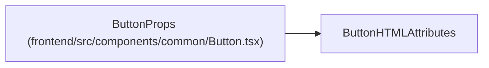

# ButtonProps

**Location:** `frontend/src/components/common/Button.tsx:6`
**Kind:** Class
**Bases:** `ButtonHTMLAttributes`
**Module:** [Button](../modules/Button.md)

## Description

_Auto-generated from `ButtonProps` in `frontend/src/components/common/Button.tsx`._

## Attributes

| Name | Type | Required | Default | Description |
|------|------|----------|---------|-------------|
| `variant` | `'primary' \| 'secondary' \| 'danger' \| 'warning' \| 'ghost' \| 'outline'` | No | — | — |
| `size` | `'sm' \| 'md' \| 'lg'` | No | — | — |
| `isLoading` | `boolean` | No | — | — |

## Methods

*No public methods. Inherits from base classes.*

## Relationships

<!-- Auto-generated relationship summary. Do not edit by hand. -->

### Summary

| Module | Methods | Attributes |
|---|---:|---|
| [Button](../modules/Button.md) | 0 | `isLoading`, `size`, `variant` |

### Structure

| Kind | Entity | Module |
|---|---|---|
| Base | `ButtonHTMLAttributes` | — |
