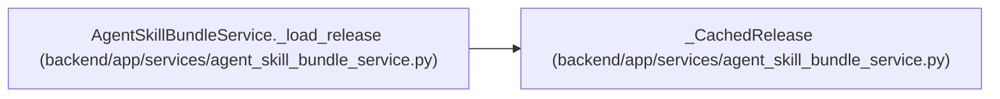

# _CachedRelease

**Location:** `backend/app/services/agent_skill_bundle_service.py:98`
**Kind:** Class
**Bases:** —
**Module:** [agent_skill_bundle_service](../modules/agent_skill_bundle_service.md)

**Decorators:** `@dataclass(frozen=True)`

## Description

_Auto-generated from `_CachedRelease` in `backend/app/services/agent_skill_bundle_service.py`._

## Attributes

| Name | Type | Default | Description |
|------|------|---------|-------------|
| `identity` | `tuple[Any, ...]` | *required* | — |
| `release` | `_LoadedRelease` | *required* | — |

## Methods

*No public methods. Inherits from base classes.*

## Relationships

<!-- Auto-generated relationship summary. Do not edit by hand. -->

### Summary

| Module | Methods | Attributes |
|---|---:|---|
| [agent_skill_bundle_service](../modules/agent_skill_bundle_service.md) | 0 | `identity`, `release` |

### References

| Reference | Kind | Source | Call sites |
|---|---|---|---:|
| `AgentSkillBundleService._load_release` | call | [agent_skill_bundle_service](../modules/agent_skill_bundle_service.md) | 1 |
