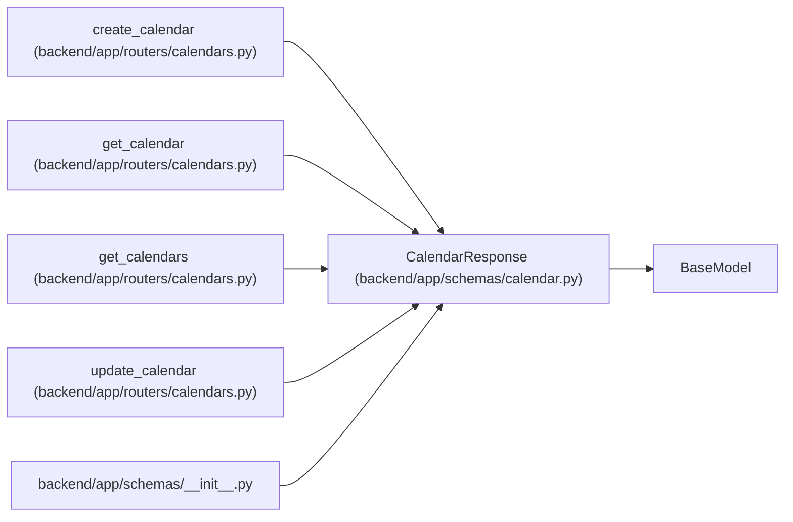

# CalendarResponse

**Location:** `backend/app/schemas/calendar.py:34`
**Kind:** Pydantic model
**Bases:** `BaseModel`
**Module:** [schemas_calendar](../modules/schemas_calendar.md)

## Description

Schema for calendar response.

## Model Configuration

| Setting | Value | Source |
|---------|-------|--------|
| `from_attributes` | `True` | config_class |

## Attributes

| Name | Type | Wire name | Required | Nullable | Default | Constraints | Examples | Description |
|------|------|-----------|----------|----------|---------|-------------|-------------|----------|
| `timezone` | `str` | `timezone` | No | No | `'UTC'` | — | — | — |
| `nominal_day_hours` | `float` | `nominal_day_hours` | No | No | `8` | — | — | — |
| `id` | `int` | `id` | Yes | No | — | — | — | — |
| `name` | `str` | `name` | Yes | No | — | — | — | — |
| `year` | `int` | `year` | Yes | No | — | — | — | — |
| `holidays` | `list[str]` | `holidays` | Yes | No | — | — | — | — |
| `weekend_days` | `list[int]` | `weekend_days` | Yes | No | — | — | — | — |
| `short_days` | `list[str]` | `short_days` | No | No | `[]` | — | — | — |

## Methods

*No public methods. Inherits from base classes.*

## Relationships

<!-- Auto-generated relationship summary. Do not edit by hand. -->

### Summary

| Module | Methods | Attributes |
|---|---:|---|
| [schemas_calendar](../modules/schemas_calendar.md) | 0 | `holidays`, `id`, `name`, `nominal_day_hours`, `short_days`, `timezone`, `weekend_days`, `year` |

### Structure

| Kind | Entity | Module |
|---|---|---|
| Base | `BaseModel` | — |

### References

| Reference | Kind | Source | Call sites |
|---|---|---|---:|
| `create_calendar` | type_reference | [calendars](../modules/calendars.md) | — |
| `get_calendar` | type_reference | [calendars](../modules/calendars.md) | — |
| `get_calendars` | type_reference | [calendars](../modules/calendars.md) | — |
| `update_calendar` | type_reference | [calendars](../modules/calendars.md) | — |
| `__init__` | import | [schemas___init__](../modules/schemas___init__.md) | — |
