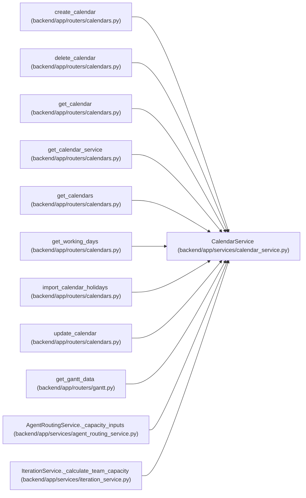

# CalendarService

**Location:** `backend/app/services/calendar_service.py:64`
**Kind:** Class
**Bases:** —
**Module:** [calendar_service](../modules/calendar_service.md)

## Description

Service for calendar operations.

## Attributes

*No annotated attributes found.*

## Methods

| Method | Signature | Decorators | Description |
|--------|-----------|------------|-------------|
| `__init__` | `(db: AsyncSession)` | — | — |
| `get_all` | *(async)* `() -> Sequence[Calendar]` | — | Get all calendars. |
| `get_or_create_default` | *(async)* `(*, commit: bool = True) -> Calendar` | — | Return the default calendar, optionally deferring creation commit. |
| `get_by_id` | *(async)* `(calendar_id: int) -> Calendar \| None` | — | Get calendar by ID. |
| `create` | *(async)* `(data: CalendarCreate) -> Calendar` | — | Create a new calendar. |
| `update` | *(async)* `(calendar_id: int, data: CalendarUpdate) -> Calendar \| None` | `@schedule_input_command('calendar')` | Update an existing calendar. |
| `delete` | *(async)* `(calendar_id: int) -> bool` | `@schedule_input_command('calendar')` | Delete a calendar. |
| `_public_holidays` | `(country: str, year: int) -> list[str]` | — | Return deterministic built-in public holiday dates for a country/year. |
| `_parse_holiday_csv` | `(csv_text: str \| None) -> tuple[list[str], list[CalendarImportError]]` | — | Parse holiday CSV rows with a required date column. |
| `_merge_holidays` | `(existing_holidays: Iterable[str], imported_holidays: Iterable[str]) -> tuple[list[str], int, int]` | — | Merge imported holiday dates into existing holiday strings. |
| `import_holidays` | *(async)* `(calendar_id: int, data: CalendarImportRequest) -> CalendarImportResponse \| None` | `@schedule_input_command('calendar')` | Import public or CSV holiday dates into a calendar. |
| `calculate_working_days` | `(calendar: Calendar, start_date: date, end_date: date) -> WorkingDaysResponse` | — | Calculate working days for a period. |
| `get_working_dates` | `(calendar: Calendar, start_date: date, end_date: date) -> list[date]` | — | Get list of working dates in a period. |

## Relationships

<!-- Auto-generated relationship summary. Do not edit by hand. -->

### Summary

| Module | Methods | Attributes |
|---|---:|---|
| [calendar_service](../modules/calendar_service.md) | 13 | — |

### References

| Reference | Kind | Source | Call sites |
|---|---|---|---:|
| `create_calendar` | type_reference | [calendars](../modules/calendars.md) | — |
| `delete_calendar` | type_reference | [calendars](../modules/calendars.md) | — |
| `get_calendar` | type_reference | [calendars](../modules/calendars.md) | — |
| `get_calendar_service` | call | [calendars](../modules/calendars.md) | 1 |
| `get_calendar_service` | type_reference | [calendars](../modules/calendars.md) | — |
| `get_calendars` | type_reference | [calendars](../modules/calendars.md) | — |
| `get_working_days` | type_reference | [calendars](../modules/calendars.md) | — |
| `import_calendar_holidays` | type_reference | [calendars](../modules/calendars.md) | — |
| `update_calendar` | type_reference | [calendars](../modules/calendars.md) | — |
| `get_gantt_data` | call | [routers_gantt](../modules/routers_gantt.md) | 1 |
| `AgentRoutingService._capacity_inputs` | call | [agent_routing_service](../modules/agent_routing_service.md) | 1 |
| `IterationService._calculate_team_capacity` | call | [iteration_service](../modules/iteration_service.md) | 1 |

> References: showing 12 of 24 logical references; 12 omitted by the 12-row generated summary limit.
