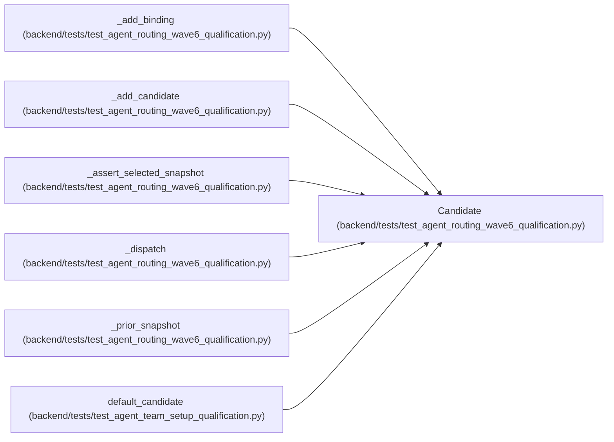

# Candidate

**Location:** `backend/tests/test_agent_routing_wave6_qualification.py:93`
**Kind:** Class
**Bases:** —
**Module:** [test_agent_routing_wave6_qualification](../modules/test_agent_routing_wave6_qualification.md)

**Decorators:** `@dataclass(frozen=True)`

## Description

_Auto-generated from `Candidate` in `backend/tests/test_agent_routing_wave6_qualification.py`._

## Attributes

| Name | Type | Default | Description |
|------|------|---------|-------------|
| `actor` | `AgentActor` | *required* | — |
| `binding` | `AgentModelBinding` | *required* | — |
| `catalog` | `AgentModelCatalogEntry` | *required* | — |

## Methods

*No public methods. Inherits from base classes.*

## Relationships

<!-- Auto-generated relationship summary. Do not edit by hand. -->

### Summary

| Module | Methods | Attributes |
|---|---:|---|
| [test_agent_routing_wave6_qualification](../modules/test_agent_routing_wave6_qualification.md) | 0 | `actor`, `binding`, `catalog` |

### References

| Reference | Kind | Source | Call sites |
|---|---|---|---:|
| `_add_binding` | call | [test_agent_routing_wave6_qualification](../modules/test_agent_routing_wave6_qualification.md) | 1 |
| `_add_binding` | type_reference | [test_agent_routing_wave6_qualification](../modules/test_agent_routing_wave6_qualification.md) | — |
| `_add_candidate` | type_reference | [test_agent_routing_wave6_qualification](../modules/test_agent_routing_wave6_qualification.md) | — |
| `_assert_selected_snapshot` | type_reference | [test_agent_routing_wave6_qualification](../modules/test_agent_routing_wave6_qualification.md) | — |
| `_dispatch` | type_reference | [test_agent_routing_wave6_qualification](../modules/test_agent_routing_wave6_qualification.md) | — |
| `_prior_snapshot` | type_reference | [test_agent_routing_wave6_qualification](../modules/test_agent_routing_wave6_qualification.md) | — |
| `default_candidate` | call | [test_agent_team_setup_qualification](../modules/test_agent_team_setup_qualification.md) | 1 |
| `default_candidate` | type_reference | [test_agent_team_setup_qualification](../modules/test_agent_team_setup_qualification.md) | — |
