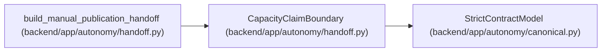

# CapacityClaimBoundary

**Location:** `backend/app/autonomy/handoff.py:78`
**Kind:** Pydantic model
**Bases:** `StrictContractModel`
**Module:** [handoff](../modules/handoff.md)

## Description

_Auto-generated from `CapacityClaimBoundary` in `backend/app/autonomy/handoff.py`._

## Attributes

| Name | Type | Wire name | Required | Nullable | Default | Constraints | Examples | Description |
|------|------|-----------|----------|----------|---------|-------------|-------------|----------|
| `opaque_browser_identities` | `Literal[1250]` | `opaque_browser_identities` | No | No | `1250` | — | — | — |
| `active_browser_sessions` | `Literal[250]` | `active_browser_sessions` | No | No | `250` | — | — | — |
| `concurrent_mcp_agent_clients` | `Literal[200]` | `concurrent_mcp_agent_clients` | No | No | `200` | — | — | — |
| `authenticated_people_claim_allowed` | `Literal[False]` | `authenticated_people_claim_allowed` | No | No | `False` | — | — | — |

## Methods

*No public methods. Inherits from base classes.*

## Relationships

<!-- Auto-generated relationship summary. Do not edit by hand. -->

### Summary

| Module | Methods | Attributes |
|---|---:|---|
| [handoff](../modules/handoff.md) | 0 | `active_browser_sessions`, `authenticated_people_claim_allowed`, `concurrent_mcp_agent_clients`, `opaque_browser_identities` |

### Structure

| Kind | Entity | Module |
|---|---|---|
| Base | `StrictContractModel` | [autonomy_canonical](../modules/autonomy_canonical.md) |

### References

| Reference | Kind | Source | Call sites |
|---|---|---|---:|
| `build_manual_publication_handoff` | call | [handoff](../modules/handoff.md) | 1 |
