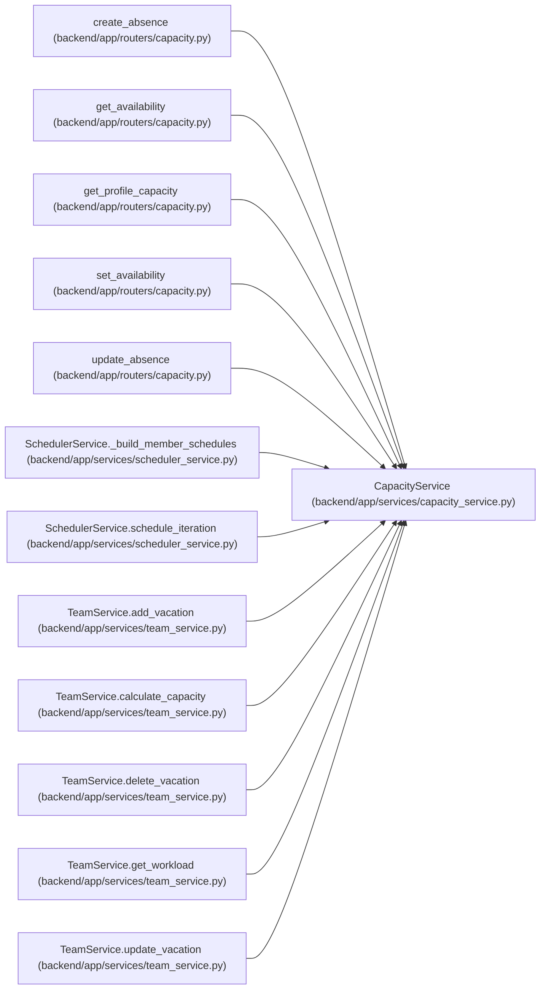

# CapacityService

**Location:** `backend/app/services/capacity_service.py:27`
**Kind:** Class
**Bases:** —
**Module:** [capacity_service](../modules/capacity_service.md)

## Description

Owns person availability commands and date-bounded cross-project capacity projections. The linked human or an operator may edit the calendar and versioned absences. Private allocations contribute only aggregate busy hours; unestimated commitments remain explicitly unknown.

## Attributes

*No annotated attributes found.*

## Methods

| Method | Signature | Decorators | Description |
|--------|-----------|------------|-------------|
| `__init__` | `(db)` | — | — |
| `require_owner` | `(profile_id)` | — | — |
| `require_visible` | *(async)* `(profile_id)` | — | — |
| `calendar_for` | *(async)* `(member)` | — | Use durable rules; retain a flagged local fallback until conflicts are reconciled. |
| `calendar_status` | *(async)* `(member)` | — | — |
| `absence_ranges` | *(async)* `(member)` | — | Never return these private ranges to a transport; expose only capacity totals. |
| `invalidate_profile` | *(async)* `(profile_id)` | — | Update private derived revisions without exposing or rewriting their planning content. |
| `detail` | *(async)* `(profile_id)` | — | — |
| `set_calendar` | *(async)* `(profile_id, calendar_id, expected_version)` | `@atomic_command` | — |
| `save_absence` | *(async)* `(profile_id, start, end, *, absence_id = None, expected_version = None, deleted = False)` | `@atomic_command` | — |
| `projection` | *(async)* `(profile_id, start, end)` | — | — |
| `schedule_issues` | *(async)* `(iteration, members)` | — | Return aggregate constraints without exposing private work or changing existing plans. |

## Relationships

<!-- Auto-generated relationship summary. Do not edit by hand. -->

### Summary

| Module | Methods | Attributes |
|---|---:|---|
| [capacity_service](../modules/capacity_service.md) | 12 | — |

### References

| Reference | Kind | Source | Call sites |
|---|---|---|---:|
| `create_absence` | call | [routers_capacity](../modules/routers_capacity.md) | 1 |
| `get_availability` | call | [routers_capacity](../modules/routers_capacity.md) | 1 |
| `get_profile_capacity` | call | [routers_capacity](../modules/routers_capacity.md) | 1 |
| `set_availability` | call | [routers_capacity](../modules/routers_capacity.md) | 1 |
| `update_absence` | call | [routers_capacity](../modules/routers_capacity.md) | 1 |
| `SchedulerService._build_member_schedules` | call | [scheduler_service](../modules/scheduler_service.md) | 1 |
| `SchedulerService.schedule_iteration` | call | [scheduler_service](../modules/scheduler_service.md) | 2 |
| `TeamService.add_vacation` | call | [team_service](../modules/team_service.md) | 1 |
| `TeamService.calculate_capacity` | call | [team_service](../modules/team_service.md) | 1 |
| `TeamService.delete_vacation` | call | [team_service](../modules/team_service.md) | 1 |
| `TeamService.get_workload` | call | [team_service](../modules/team_service.md) | 1 |
| `TeamService.update_vacation` | call | [team_service](../modules/team_service.md) | 1 |

> References: showing 12 of 23 logical references; 11 omitted by the 12-row generated summary limit.
