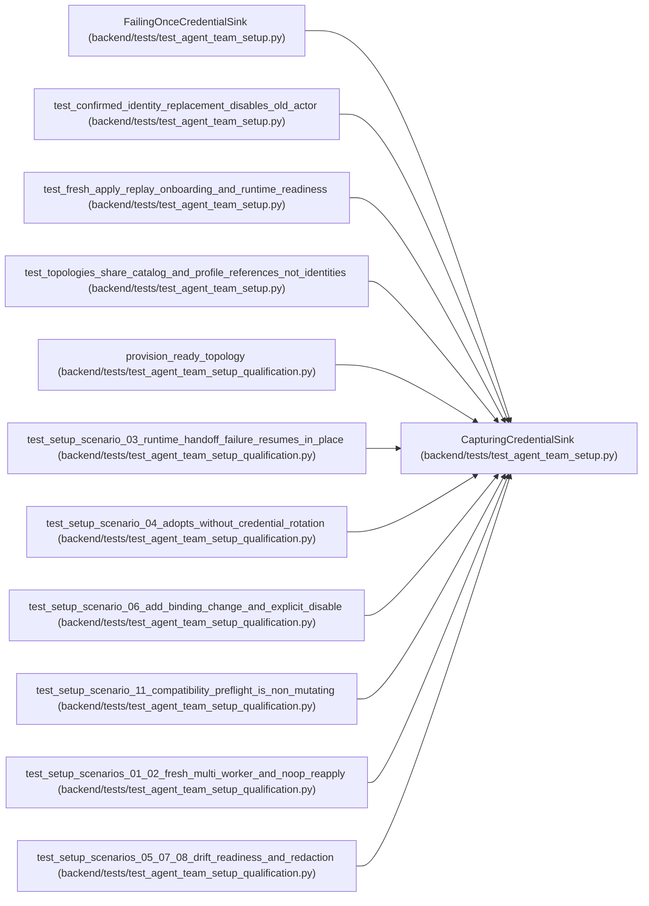

# CapturingCredentialSink

**Location:** `backend/tests/test_agent_team_setup.py:71`
**Kind:** Class
**Bases:** —
**Module:** [test_agent_team_setup](../modules/test_agent_team_setup.md)

## Description

_Auto-generated from `CapturingCredentialSink` in `backend/tests/test_agent_team_setup.py`._

## Attributes

*No annotated attributes found.*

## Methods

| Method | Signature | Decorators | Description |
|--------|-----------|------------|-------------|
| `__init__` | `() -> None` | — | — |
| `deliver` | *(async)* `(*, credential_ref: str, actor_key: str, actor_name: str, api_key: str) -> str` | — | — |

## Relationships

<!-- Auto-generated relationship summary. Do not edit by hand. -->

### Summary

| Module | Methods | Attributes |
|---|---:|---|
| [test_agent_team_setup](../modules/test_agent_team_setup.md) | 2 | — |

### Structure

| Kind | Entity | Module |
|---|---|---|
| Subclass | `FailingOnceCredentialSink` | [test_agent_team_setup](../modules/test_agent_team_setup.md) |

### References

| Reference | Kind | Source | Call sites |
|---|---|---|---:|
| `test_confirmed_identity_replacement_disables_old_actor` | call | [test_agent_team_setup](../modules/test_agent_team_setup.md) | 1 |
| `test_fresh_apply_replay_onboarding_and_runtime_readiness` | call | [test_agent_team_setup](../modules/test_agent_team_setup.md) | 1 |
| `test_topologies_share_catalog_and_profile_references_not_identities` | call | [test_agent_team_setup](../modules/test_agent_team_setup.md) | 1 |
| `provision_ready_topology` | call | [test_agent_team_setup_qualification](../modules/test_agent_team_setup_qualification.md) | 1 |
| `test_setup_scenario_03_runtime_handoff_failure_resumes_in_place` | call | [test_agent_team_setup_qualification](../modules/test_agent_team_setup_qualification.md) | 1 |
| `test_setup_scenario_04_adopts_without_credential_rotation` | call | [test_agent_team_setup_qualification](../modules/test_agent_team_setup_qualification.md) | 1 |
| `test_setup_scenario_06_add_binding_change_and_explicit_disable` | call | [test_agent_team_setup_qualification](../modules/test_agent_team_setup_qualification.md) | 1 |
| `test_setup_scenario_11_compatibility_preflight_is_non_mutating` | call | [test_agent_team_setup_qualification](../modules/test_agent_team_setup_qualification.md) | 1 |
| `test_setup_scenarios_01_02_fresh_multi_worker_and_noop_reapply` | call | [test_agent_team_setup_qualification](../modules/test_agent_team_setup_qualification.md) | 1 |
| `test_setup_scenarios_05_07_08_drift_readiness_and_redaction` | call | [test_agent_team_setup_qualification](../modules/test_agent_team_setup_qualification.md) | 1 |
