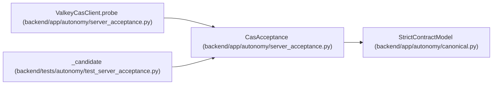

# CasAcceptance

**Location:** `backend/app/autonomy/server_acceptance.py:115`
**Kind:** Pydantic model
**Bases:** `StrictContractModel`
**Module:** [autonomy_server_acceptance](../modules/autonomy_server_acceptance.md)

## Description

_Auto-generated from `CasAcceptance` in `backend/app/autonomy/server_acceptance.py`._

## Attributes

| Name | Type | Wire name | Required | Nullable | Default | Constraints | Examples | Description |
|------|------|-----------|----------|----------|---------|-------------|-------------|----------|
| `implementation` | `Literal['valkey-aof-cas']` | `implementation` | No | No | `'valkey-aof-cas'` | — | — | — |
| `endpoint` | `str` | `endpoint` | Yes | No | — | pattern='^[a-zA-Z0-9.-]+:[0-9]{1,5}$' | — | — |
| `append_only_enabled` | `Literal[True]` | `append_only_enabled` | No | No | `True` | — | — | — |
| `local_aof_fsync_confirmed` | `Literal[True]` | `local_aof_fsync_confirmed` | No | No | `True` | — | — | — |
| `first_writer_won` | `Literal[True]` | `first_writer_won` | No | No | `True` | — | — | — |
| `independent_competing_writer` | `Literal[True]` | `independent_competing_writer` | No | No | `True` | — | — | — |
| `competing_writer_rejected` | `Literal[True]` | `competing_writer_rejected` | No | No | `True` | — | — | — |
| `stored_value_verified` | `Literal[True]` | `stored_value_verified` | No | No | `True` | — | — | — |

## Methods

*No public methods. Inherits from base classes.*

## Relationships

<!-- Auto-generated relationship summary. Do not edit by hand. -->

### Summary

| Module | Methods | Attributes |
|---|---:|---|
| [autonomy_server_acceptance](../modules/autonomy_server_acceptance.md) | 0 | `append_only_enabled`, `competing_writer_rejected`, `endpoint`, `first_writer_won`, `implementation`, `independent_competing_writer`, `local_aof_fsync_confirmed`, `stored_value_verified` |

### Structure

| Kind | Entity | Module |
|---|---|---|
| Base | `StrictContractModel` | [autonomy_canonical](../modules/autonomy_canonical.md) |

### References

| Reference | Kind | Source | Call sites |
|---|---|---|---:|
| `ValkeyCasClient.probe` | call | [autonomy_server_acceptance](../modules/autonomy_server_acceptance.md) | 1 |
| `ValkeyCasClient.probe` | type_reference | [autonomy_server_acceptance](../modules/autonomy_server_acceptance.md) | — |
| `_candidate` | call | [test_server_acceptance](../modules/test_server_acceptance.md) | 1 |
