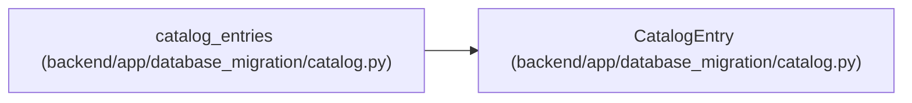

# CatalogEntry

**Location:** `backend/app/database_migration/catalog.py:43`
**Kind:** Class
**Bases:** —
**Module:** [catalog](../modules/catalog.md)

**Decorators:** `@dataclass(frozen=True)`

## Description

_Auto-generated from `CatalogEntry` in `backend/app/database_migration/catalog.py`._

## Attributes

| Name | Type | Default | Description |
|------|------|---------|-------------|
| `table_name` | `str` | *required* | — |
| `disposition` | `Literal['transfer', 'target_owned']` | *required* | — |
| `primary_key` | `tuple[str, ...]` | *required* | — |
| `staged_reference_columns` | `tuple[str, ...]` | *required* | — |

## Methods

*No public methods. Inherits from base classes.*

## Relationships

<!-- Auto-generated relationship summary. Do not edit by hand. -->

### Summary

| Module | Methods | Attributes |
|---|---:|---|
| [catalog](../modules/catalog.md) | 0 | `disposition`, `primary_key`, `staged_reference_columns`, `table_name` |

### References

| Reference | Kind | Source | Call sites |
|---|---|---|---:|
| `catalog_entries` | call | [catalog](../modules/catalog.md) | 2 |
| `catalog_entries` | type_reference | [catalog](../modules/catalog.md) | — |
