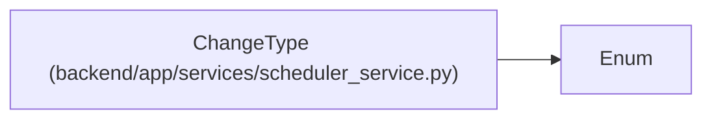

# ChangeType

**Location:** `backend/app/services/scheduler_service.py:24`
**Kind:** Enum
**Bases:** `Enum`
**Module:** [scheduler_service](../modules/scheduler_service.md)

## Description

Types of changes that trigger incremental rescheduling.

## Attributes

| Name | Declared value | Description |
|------|-------|-------------|
| `EFFORT_INCREASED` | `'effort_increased'` | — |
| `EFFORT_DECREASED` | `'effort_decreased'` | — |
| `ASSIGNEE_CHANGED` | `'assignee_changed'` | — |
| `PRIORITY_CHANGED` | `'priority_changed'` | — |
| `DEPENDENCY_ADDED` | `'dependency_added'` | — |
| `DEPENDENCY_REMOVED` | `'dependency_removed'` | — |
| `MIN_START_DATE_CHANGED` | `'min_start_changed'` | — |
| `MAX_END_DATE_CHANGED` | `'max_end_changed'` | — |
| `STATUS_CHANGED` | `'status_changed'` | — |

## Methods

*No public methods. Inherits from base classes.*

## Relationships

<!-- Auto-generated relationship summary. Do not edit by hand. -->

### Summary

| Module | Methods | Attributes |
|---|---:|---|
| [scheduler_service](../modules/scheduler_service.md) | 0 | `ASSIGNEE_CHANGED`, `DEPENDENCY_ADDED`, `DEPENDENCY_REMOVED`, `EFFORT_DECREASED`, `EFFORT_INCREASED`, `MAX_END_DATE_CHANGED`, `MIN_START_DATE_CHANGED`, `PRIORITY_CHANGED`, `STATUS_CHANGED` |

### Structure

| Kind | Entity | Module |
|---|---|---|
| Base | `Enum` | — |
