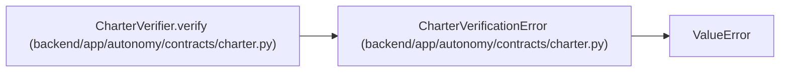

# CharterVerificationError

**Location:** `backend/app/autonomy/contracts/charter.py:362`
**Kind:** Class
**Bases:** `ValueError`
**Module:** [charter](../modules/charter.md)

## Description

_Auto-generated from `CharterVerificationError` in `backend/app/autonomy/contracts/charter.py`._

## Attributes

*No annotated attributes found.*

## Methods

*No public methods. Inherits from base classes.*

## Relationships

<!-- Auto-generated relationship summary. Do not edit by hand. -->

### Summary

| Module | Methods | Attributes |
|---|---:|---|
| [charter](../modules/charter.md) | 0 | — |

### Structure

| Kind | Entity | Module |
|---|---|---|
| Base | `ValueError` | — |

### References

| Reference | Kind | Source | Call sites |
|---|---|---|---:|
| `CharterVerifier.verify` | call | [charter](../modules/charter.md) | 12 |
