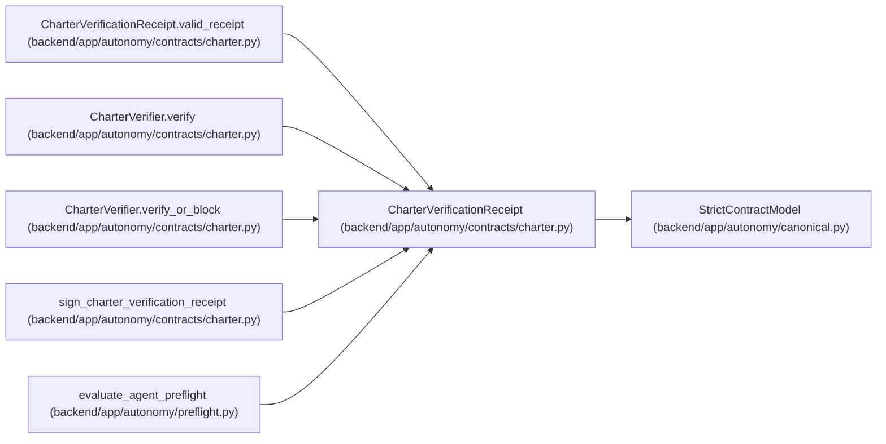

# CharterVerificationReceipt

**Location:** `backend/app/autonomy/contracts/charter.py:333`
**Kind:** Pydantic model
**Bases:** `StrictContractModel`
**Module:** [charter](../modules/charter.md)

## Description

_Auto-generated from `CharterVerificationReceipt` in `backend/app/autonomy/contracts/charter.py`._

## Validators

| Method | Scope | Fields | Mode | Options |
|--------|-------|--------|------|---------|
| `valid_receipt` | model | — | after | — |

## Attributes

| Name | Type | Wire name | Required | Nullable | Default | Constraints | Examples | Description |
|------|------|-----------|----------|----------|---------|-------------|-------------|----------|
| `schema_version` | `Literal['workchord-charter-verification-v1']` | `schema_version` | No | No | `'workchord-charter-verification-v1'` | — | — | — |
| `verified_at` | `datetime` | `verified_at` | Yes | No | — | — | — | — |
| `autonomy_state` | `AutonomyState` | `autonomy_state` | Yes | No | — | — | — | — |
| `program_decision` | `ProgramDecision` | `program_decision` | Yes | No | — | — | — | — |
| `charter_digest` | `str \| None` | `charter_digest` | No | Yes | `None` | pattern=unknown (SHA256_PATTERN) | — | — |
| `bootstrap_manifest_digest` | `str \| None` | `bootstrap_manifest_digest` | No | Yes | `None` | pattern=unknown (SHA256_PATTERN) | — | — |
| `trust_source_receipts` | `tuple[str, ...]` | `trust_source_receipts` | No | No | `()` | max_length=16 | — | — |
| `blocker_codes` | `tuple[str, ...]` | `blocker_codes` | No | No | `()` | max_length=64 | — | — |

## Methods

| Method | Signature | Decorators | Description |
|--------|-----------|------------|-------------|
| `valid_receipt` | `() -> 'CharterVerificationReceipt'` | `@model_validator(mode='after')` | — |

## Relationships

<!-- Auto-generated relationship summary. Do not edit by hand. -->

### Summary

| Module | Methods | Attributes |
|---|---:|---|
| [charter](../modules/charter.md) | 1 | `autonomy_state`, `blocker_codes`, `bootstrap_manifest_digest`, `charter_digest`, `program_decision`, `schema_version`, `trust_source_receipts`, `verified_at` |

### Structure

| Kind | Entity | Module |
|---|---|---|
| Base | `StrictContractModel` | [autonomy_canonical](../modules/autonomy_canonical.md) |

### References

| Reference | Kind | Source | Call sites |
|---|---|---|---:|
| `CharterVerificationReceipt.valid_receipt` | type_reference | [charter](../modules/charter.md) | — |
| `CharterVerifier.verify` | call | [charter](../modules/charter.md) | 1 |
| `CharterVerifier.verify` | type_reference | [charter](../modules/charter.md) | — |
| `CharterVerifier.verify_or_block` | call | [charter](../modules/charter.md) | 2 |
| `CharterVerifier.verify_or_block` | type_reference | [charter](../modules/charter.md) | — |
| `sign_charter_verification_receipt` | type_reference | [charter](../modules/charter.md) | — |
| `evaluate_agent_preflight` | type_reference | [preflight](../modules/preflight.md) | — |
