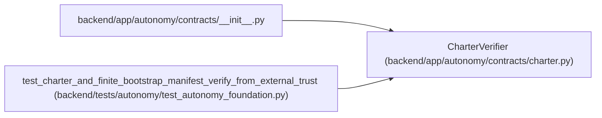

# CharterVerifier

**Location:** `backend/app/autonomy/contracts/charter.py:366`
**Kind:** Class
**Bases:** —
**Module:** [charter](../modules/charter.md)

## Description

Verify external authority without creating or broadening it.

## Attributes

*No annotated attributes found.*

## Methods

| Method | Signature | Decorators | Description |
|--------|-----------|------------|-------------|
| `__init__` | `(*, trust_resolver: PublicTrustResolver, revocation_resolver: RevocationResolver, clock: Callable[[], datetime] = lambda: datetime.now(UTC)) -> None` | — | — |
| `verify` | `(charter: SignedAutonomyCharter, bootstrap_manifest: SignedBootstrapActionManifest) -> CharterVerificationReceipt` | — | — |
| `verify_or_block` | `(charter: SignedAutonomyCharter \| None, bootstrap_manifest: SignedBootstrapActionManifest \| None) -> CharterVerificationReceipt` | — | — |

## Relationships

<!-- Auto-generated relationship summary. Do not edit by hand. -->

### Summary

| Module | Methods | Attributes |
|---|---:|---|
| [charter](../modules/charter.md) | 3 | — |

### References

| Reference | Kind | Source | Call sites |
|---|---|---|---:|
| `__init__` | import | [contracts___init__](../modules/contracts___init__.md) | — |
| `test_charter_and_finite_bootstrap_manifest_verify_from_external_trust` | call | [test_autonomy_foundation](../modules/test_autonomy_foundation.md) | 1 |
