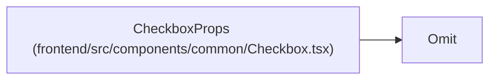

# CheckboxProps

**Location:** `frontend/src/components/common/Checkbox.tsx:6`
**Kind:** Class
**Bases:** `Omit`
**Module:** [Checkbox](../modules/Checkbox.md)

## Description

_Auto-generated from `CheckboxProps` in `frontend/src/components/common/Checkbox.tsx`._

## Attributes

| Name | Type | Default | Description |
|------|------|---------|-------------|
| `label` | `string` | *required* | — |
| `onChange` | `(checked: boolean) => void` | *required* | — |

## Methods

*No public methods. Inherits from base classes.*

## Relationships

<!-- Auto-generated relationship summary. Do not edit by hand. -->

### Summary

| Module | Methods | Attributes |
|---|---:|---|
| [Checkbox](../modules/Checkbox.md) | 0 | `label`, `onChange` |

### Structure

| Kind | Entity | Module |
|---|---|---|
| Base | `Omit` | — |
