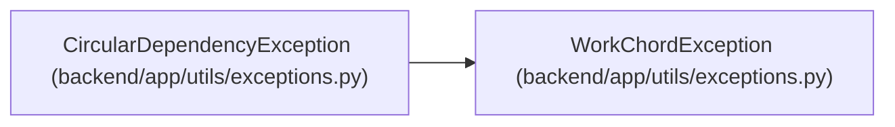

# CircularDependencyException

**Location:** `backend/app/utils/exceptions.py:36`
**Kind:** Class
**Bases:** `WorkChordException`
**Module:** [exceptions](../modules/exceptions.md)

## Description

Circular dependency detected.

## Attributes

*No annotated attributes found.*

## Methods

| Method | Signature | Decorators | Description |
|--------|-----------|------------|-------------|
| `__init__` | `(task_ids: list[int])` | — | — |

## Relationships

<!-- Auto-generated relationship summary. Do not edit by hand. -->

### Summary

| Module | Methods | Attributes |
|---|---:|---|
| [exceptions](../modules/exceptions.md) | 1 | — |

### Structure

| Kind | Entity | Module |
|---|---|---|
| Base | `WorkChordException` | [exceptions](../modules/exceptions.md) |
