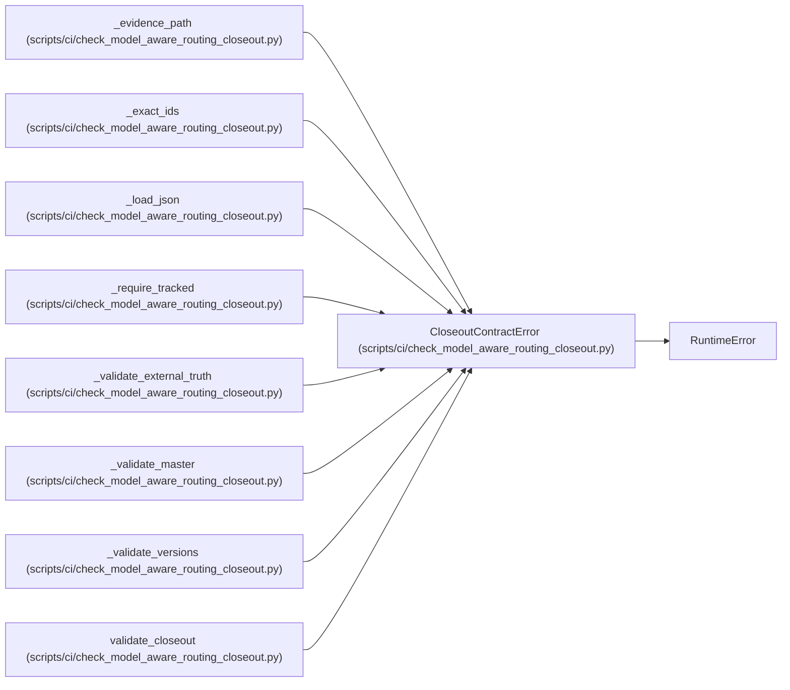

# CloseoutContractError

**Location:** `scripts/ci/check_model_aware_routing_closeout.py:51`
**Kind:** Class
**Bases:** `RuntimeError`
**Module:** [check_model_aware_routing_closeout](../modules/check_model_aware_routing_closeout.md)

## Description

Raised when closure evidence is incomplete, stale, or overclaimed.

## Attributes

*No annotated attributes found.*

## Methods

*No public methods. Inherits from base classes.*

## Relationships

<!-- Auto-generated relationship summary. Do not edit by hand. -->

### Summary

| Module | Methods | Attributes |
|---|---:|---|
| [check_model_aware_routing_closeout](../modules/check_model_aware_routing_closeout.md) | 0 | — |

### Structure

| Kind | Entity | Module |
|---|---|---|
| Base | `RuntimeError` | — |

### References

| Reference | Kind | Source | Call sites |
|---|---|---|---:|
| `_evidence_path` | call | [check_model_aware_routing_closeout](../modules/check_model_aware_routing_closeout.md) | 3 |
| `_exact_ids` | call | [check_model_aware_routing_closeout](../modules/check_model_aware_routing_closeout.md) | 7 |
| `_load_json` | call | [check_model_aware_routing_closeout](../modules/check_model_aware_routing_closeout.md) | 2 |
| `_require_tracked` | call | [check_model_aware_routing_closeout](../modules/check_model_aware_routing_closeout.md) | 1 |
| `_validate_external_truth` | call | [check_model_aware_routing_closeout](../modules/check_model_aware_routing_closeout.md) | 1 |
| `_validate_master` | call | [check_model_aware_routing_closeout](../modules/check_model_aware_routing_closeout.md) | 5 |
| `_validate_versions` | call | [check_model_aware_routing_closeout](../modules/check_model_aware_routing_closeout.md) | 9 |
| `validate_closeout` | call | [check_model_aware_routing_closeout](../modules/check_model_aware_routing_closeout.md) | 2 |
