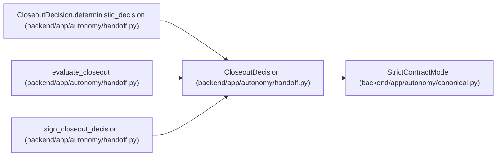

# CloseoutDecision

**Location:** `backend/app/autonomy/handoff.py:166`
**Kind:** Pydantic model
**Bases:** `StrictContractModel`
**Module:** [handoff](../modules/handoff.md)

## Description

_Auto-generated from `CloseoutDecision` in `backend/app/autonomy/handoff.py`._

## Validators

| Method | Scope | Fields | Mode | Options |
|--------|-------|--------|------|---------|
| `deterministic_decision` | model | — | after | — |

## Attributes

| Name | Type | Wire name | Required | Nullable | Default | Constraints | Examples | Description |
|------|------|-----------|----------|----------|---------|-------------|-------------|----------|
| `schema_version` | `Literal['workchord-postgresql-closeout-decision-v1']` | `schema_version` | No | No | `'workchord-postgresql-closeout-decision-v1'` | — | — | — |
| `evaluator_identity` | `Literal['pg-closeout-evaluator']` | `evaluator_identity` | No | No | `'pg-closeout-evaluator'` | — | — | — |
| `evaluated_at` | `datetime` | `evaluated_at` | Yes | No | — | — | — | — |
| `valid_until` | `datetime` | `valid_until` | Yes | No | — | — | — | — |
| `decision` | `ProgramDecision` | `decision` | Yes | No | — | — | — | — |
| `handoff_digest` | `str` | `handoff_digest` | Yes | No | — | pattern=unknown (SHA256_PATTERN) | — | — |
| `status_ledger_digest` | `str` | `status_ledger_digest` | Yes | No | — | pattern=unknown (SHA256_PATTERN) | — | — |
| `availability_state` | `AvailabilityState` | `availability_state` | Yes | No | — | — | — | — |
| `retention_state` | `RetentionState` | `retention_state` | Yes | No | — | — | — | — |
| `blocker_codes` | `tuple[str, ...]` | `blocker_codes` | Yes | No | — | max_length=512 | — | — |
| `manual_external_items` | `tuple[Literal['DBM-DOC-002', 'G15'], ...]` | `manual_external_items` | No | No | `('DBM-DOC-002', 'G15')` | — | — | — |
| `external_post_publication_items` | `tuple[Literal['DBM-CLOSE-001'], ...]` | `external_post_publication_items` | No | No | `('DBM-CLOSE-001',)` | — | — | — |
| `decision_digest` | `str` | `decision_digest` | Yes | No | — | pattern=unknown (SHA256_PATTERN) | — | — |

## Methods

| Method | Signature | Decorators | Description |
|--------|-----------|------------|-------------|
| `deterministic_decision` | `() -> 'CloseoutDecision'` | `@model_validator(mode='after')` | — |

## Relationships

<!-- Auto-generated relationship summary. Do not edit by hand. -->

### Summary

| Module | Methods | Attributes |
|---|---:|---|
| [handoff](../modules/handoff.md) | 1 | `availability_state`, `blocker_codes`, `decision`, `decision_digest`, `evaluated_at`, `evaluator_identity`, `external_post_publication_items`, `handoff_digest`, `manual_external_items`, `retention_state`, `schema_version`, `status_ledger_digest` |

### Structure

| Kind | Entity | Module |
|---|---|---|
| Base | `StrictContractModel` | [autonomy_canonical](../modules/autonomy_canonical.md) |

### References

| Reference | Kind | Source | Call sites |
|---|---|---|---:|
| `CloseoutDecision.deterministic_decision` | type_reference | [handoff](../modules/handoff.md) | — |
| `evaluate_closeout` | call | [handoff](../modules/handoff.md) | 1 |
| `evaluate_closeout` | type_reference | [handoff](../modules/handoff.md) | — |
| `sign_closeout_decision` | type_reference | [handoff](../modules/handoff.md) | — |
