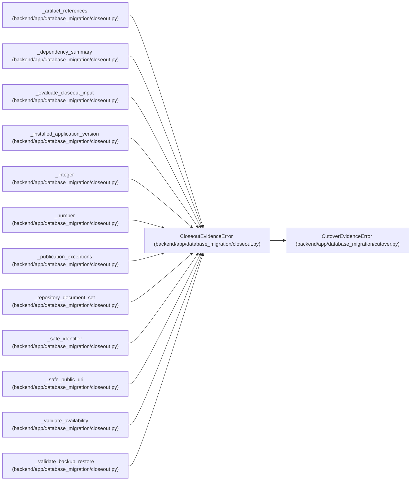

# CloseoutEvidenceError

**Location:** `backend/app/database_migration/closeout.py:149`
**Kind:** Class
**Bases:** `CutoverEvidenceError`
**Module:** [database_migration_closeout](../modules/database_migration_closeout.md)

## Description

A post-cutover publication or closure input is incomplete or unsafe.

## Attributes

*No annotated attributes found.*

## Methods

*No public methods. Inherits from base classes.*

## Relationships

<!-- Auto-generated relationship summary. Do not edit by hand. -->

### Summary

| Module | Methods | Attributes |
|---|---:|---|
| [database_migration_closeout](../modules/database_migration_closeout.md) | 0 | — |

### Structure

| Kind | Entity | Module |
|---|---|---|
| Base | `CutoverEvidenceError` | [database_migration_cutover](../modules/database_migration_cutover.md) |

### References

| Reference | Kind | Source | Call sites |
|---|---|---|---:|
| `_artifact_references` | call | [database_migration_closeout](../modules/database_migration_closeout.md) | 5 |
| `_dependency_summary` | call | [database_migration_closeout](../modules/database_migration_closeout.md) | 10 |
| `_evaluate_closeout_input` | call | [database_migration_closeout](../modules/database_migration_closeout.md) | 10 |
| `_installed_application_version` | call | [database_migration_closeout](../modules/database_migration_closeout.md) | 2 |
| `_integer` | call | [database_migration_closeout](../modules/database_migration_closeout.md) | 1 |
| `_number` | call | [database_migration_closeout](../modules/database_migration_closeout.md) | 2 |
| `_publication_exceptions` | call | [database_migration_closeout](../modules/database_migration_closeout.md) | 4 |
| `_repository_document_set` | call | [database_migration_closeout](../modules/database_migration_closeout.md) | 7 |
| `_safe_identifier` | call | [database_migration_closeout](../modules/database_migration_closeout.md) | 1 |
| `_safe_public_uri` | call | [database_migration_closeout](../modules/database_migration_closeout.md) | 5 |
| `_validate_availability` | call | [database_migration_closeout](../modules/database_migration_closeout.md) | 12 |
| `_validate_backup_restore` | call | [database_migration_closeout](../modules/database_migration_closeout.md) | 4 |

> References: showing 12 of 27 logical references; 15 omitted by the 12-row generated summary limit.
