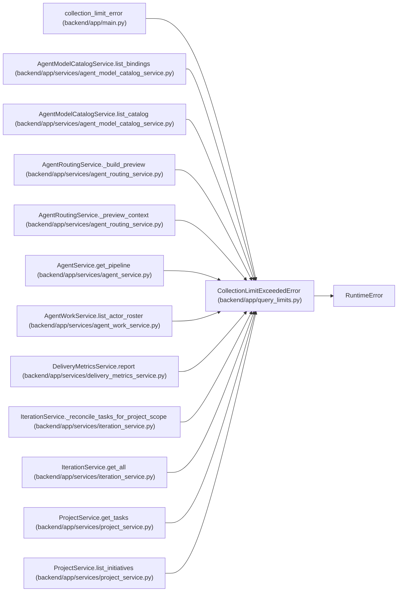

# CollectionLimitExceededError

**Location:** `backend/app/query_limits.py:14`
**Kind:** Class
**Bases:** `RuntimeError`
**Module:** [query_limits](../modules/query_limits.md)

## Description

A synchronous endpoint would exceed its documented response bound.

## Attributes

*No annotated attributes found.*

## Methods

| Method | Signature | Decorators | Description |
|--------|-----------|------------|-------------|
| `__init__` | `(resource: str, maximum: int)` | — | — |
| `detail` | `() -> dict[str, object]` | — | — |

## Relationships

<!-- Auto-generated relationship summary. Do not edit by hand. -->

### Summary

| Module | Methods | Attributes |
|---|---:|---|
| [query_limits](../modules/query_limits.md) | 2 | — |

### Structure

| Kind | Entity | Module |
|---|---|---|
| Base | `RuntimeError` | — |

### References

| Reference | Kind | Source | Call sites |
|---|---|---|---:|
| `collection_limit_error` | type_reference | [app_main](../modules/app_main.md) | — |
| `AgentModelCatalogService.list_bindings` | call | [agent_model_catalog_service](../modules/agent_model_catalog_service.md) | 1 |
| `AgentModelCatalogService.list_catalog` | call | [agent_model_catalog_service](../modules/agent_model_catalog_service.md) | 1 |
| `AgentRoutingService._build_preview` | call | [agent_routing_service](../modules/agent_routing_service.md) | 3 |
| `AgentRoutingService._preview_context` | call | [agent_routing_service](../modules/agent_routing_service.md) | 4 |
| `AgentService.get_pipeline` | call | [agent_service](../modules/agent_service.md) | 1 |
| `AgentWorkService.list_actor_roster` | call | [agent_work_service](../modules/agent_work_service.md) | 1 |
| `DeliveryMetricsService.report` | call | [delivery_metrics_service](../modules/delivery_metrics_service.md) | 3 |
| `IterationService._reconcile_tasks_for_project_scope` | call | [iteration_service](../modules/iteration_service.md) | 1 |
| `IterationService.get_all` | call | [iteration_service](../modules/iteration_service.md) | 1 |
| `ProjectService.get_tasks` | call | [project_service](../modules/project_service.md) | 1 |
| `ProjectService.list_initiatives` | call | [project_service](../modules/project_service.md) | 1 |

> References: showing 12 of 28 logical references; 16 omitted by the 12-row generated summary limit.
