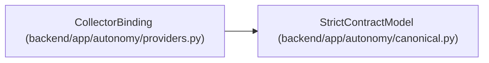

# CollectorBinding

**Location:** `backend/app/autonomy/providers.py:192`
**Kind:** Pydantic model
**Bases:** `StrictContractModel`
**Module:** [providers](../modules/providers.md)

## Description

_Auto-generated from `CollectorBinding` in `backend/app/autonomy/providers.py`._

## Attributes

| Name | Type | Wire name | Required | Nullable | Default | Constraints | Examples | Description |
|------|------|-----------|----------|----------|---------|-------------|-------------|----------|
| `fact_kind` | `str` | `fact_kind` | Yes | No | — | pattern=unknown (IDENTIFIER_PATTERN) | — | — |
| `source_system` | `str` | `source_system` | Yes | No | — | pattern=unknown (IDENTIFIER_PATTERN) | — | — |
| `collector_identity` | `Literal['pg-source-collector']` | `collector_identity` | No | No | `'pg-source-collector'` | — | — | — |
| `maximum_age_seconds` | `int` | `maximum_age_seconds` | Yes | No | — | ge=1; le=2592000 | — | — |
| `completeness_rule` | `str` | `completeness_rule` | Yes | No | — | max_length=1024; min_length=1 | — | — |
| `source_query_schema` | `str` | `source_query_schema` | Yes | No | — | pattern=unknown (IDENTIFIER_PATTERN) | — | — |

## Methods

*No public methods. Inherits from base classes.*

## Relationships

<!-- Auto-generated relationship summary. Do not edit by hand. -->

### Summary

| Module | Methods | Attributes |
|---|---:|---|
| [providers](../modules/providers.md) | 0 | `collector_identity`, `completeness_rule`, `fact_kind`, `maximum_age_seconds`, `source_query_schema`, `source_system` |

### Structure

| Kind | Entity | Module |
|---|---|---|
| Base | `StrictContractModel` | [autonomy_canonical](../modules/autonomy_canonical.md) |
