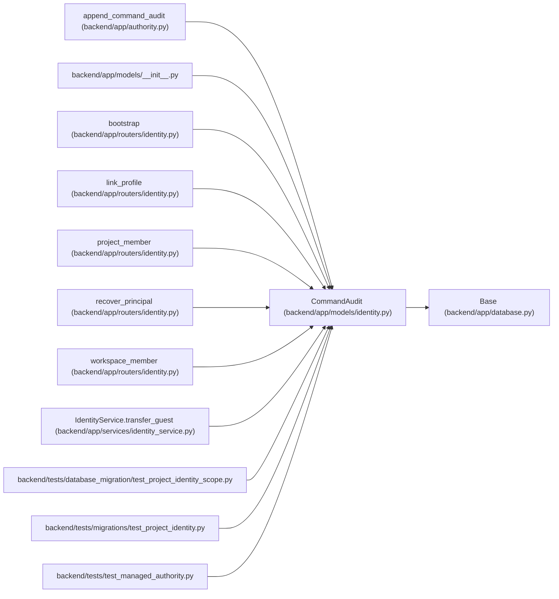

# CommandAudit

**Location:** `backend/app/models/identity.py:86`
**Kind:** Class
**Bases:** `Base`
**Module:** [models_identity](../modules/models_identity.md)

## Description

_Auto-generated from `CommandAudit` in `backend/app/models/identity.py`._

## Attributes

| Name | Type | Default | Description |
|------|------|---------|-------------|
| `id` | `Mapped[int]` | `mapped_column(Integer, primary_key=True)` | — |
| `principal_id` | `Mapped[int \| None]` | `mapped_column(ForeignKey('principals.id', ondelete='RESTRICT'), index=True)` | — |
| `project_id` | `Mapped[int \| None]` | `mapped_column(ForeignKey('projects.id', ondelete='SET NULL'), index=True)` | — |
| `action` | `Mapped[str]` | `mapped_column(String(128), nullable=False)` | — |
| `source` | `Mapped[str]` | `mapped_column(String(32), nullable=False)` | — |
| `correlation_id` | `Mapped[str]` | `mapped_column(String(128), nullable=False)` | — |
| `reason` | `Mapped[str \| None]` | `mapped_column(Text)` | — |
| `details` | `Mapped[dict]` | `mapped_column(JSON, default=dict, nullable=False)` | — |
| `created_at` | `Mapped[datetime]` | `mapped_column(UTCDateTime(), default=utc_now, index=True)` | — |

## Methods

*No public methods. Inherits from base classes.*

## Relationships

<!-- Auto-generated relationship summary. Do not edit by hand. -->

### Summary

| Module | Methods | Attributes |
|---|---:|---|
| [models_identity](../modules/models_identity.md) | 0 | `action`, `correlation_id`, `created_at`, `details`, `id`, `principal_id`, `project_id`, `reason`, `source` |

### Structure

| Kind | Entity | Module |
|---|---|---|
| Base | `Base` | [app_database](../modules/app_database.md) |

### References

| Reference | Kind | Source | Call sites |
|---|---|---|---:|
| `append_command_audit` | call | [authority](../modules/authority.md) | 1 |
| `__init__` | import | [models___init__](../modules/models___init__.md) | — |
| `bootstrap` | call | [routers_identity](../modules/routers_identity.md) | 1 |
| `link_profile` | call | [routers_identity](../modules/routers_identity.md) | 1 |
| `project_member` | call | [routers_identity](../modules/routers_identity.md) | 1 |
| `recover_principal` | call | [routers_identity](../modules/routers_identity.md) | 1 |
| `workspace_member` | call | [routers_identity](../modules/routers_identity.md) | 1 |
| `IdentityService.transfer_guest` | call | [identity_service](../modules/identity_service.md) | 1 |
| `test_project_identity_scope` | import | [test_project_identity_scope](../modules/test_project_identity_scope.md) | — |
| `test_project_identity` | import | [test_project_identity](../modules/test_project_identity.md) | — |
| `test_managed_authority` | import | [test_managed_authority](../modules/test_managed_authority.md) | — |
