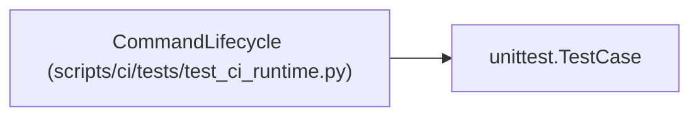

# CommandLifecycle

**Location:** `scripts/ci/tests/test_ci_runtime.py:18`
**Kind:** Class
**Bases:** `unittest.TestCase`
**Module:** [test_ci_runtime](../modules/test_ci_runtime.md)

## Description

_Auto-generated from `CommandLifecycle` in `scripts/ci/tests/test_ci_runtime.py`._

## Attributes

*No annotated attributes found.*

## Methods

| Method | Signature | Decorators | Description |
|--------|-----------|------------|-------------|
| `test_darwin_permission_probe_requires_confirmed_group_absence` | `()` | — | — |
| `test_running_receipt_exists_before_command_and_success_is_finalized` | `()` | — | — |
| `test_failure_cannot_be_hidden_by_continue_after_error` | `()` | — | — |
| `test_timeout_kills_descendants_even_when_the_parent_exits_on_term` | `()` | — | — |
| `test_service_descendants_that_exit_on_term_are_cleaned_successfully` | `()` | — | — |
| `test_job_budget_limits_a_longer_command_deadline` | `()` | — | — |
| `test_sigterm_persists_cancellation_and_stops_active_command` | `()` | — | — |
| `test_elapsed_setup_reduces_work_budget` | `()` | — | — |
| `test_hard_kill_leaves_an_incomplete_receipt` | `()` | — | — |
| `test_receipt_survives_cleanup_failure` | `()` | — | — |

## Relationships

<!-- Auto-generated relationship summary. Do not edit by hand. -->

### Summary

| Module | Methods | Attributes |
|---|---:|---|
| [test_ci_runtime](../modules/test_ci_runtime.md) | 10 | — |

### Structure

| Kind | Entity | Module |
|---|---|---|
| Base | `unittest.TestCase` | — |
