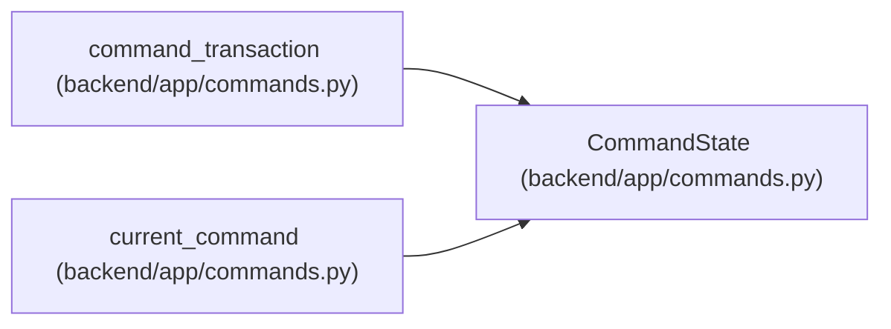

# CommandState

**Location:** `backend/app/commands.py:13`
**Kind:** Class
**Bases:** —
**Module:** [commands](../modules/commands.md)

**Decorators:** `@dataclass`

## Description

_Auto-generated from `CommandState` in `backend/app/commands.py`._

## Attributes

| Name | Type | Default | Description |
|------|------|---------|-------------|
| `mode` | `Literal['apply', 'preview']` | `'apply'` | — |
| `iterations` | `dict[int, int]` | `field(default_factory=dict)` | — |
| `snapshots` | `set[int]` | `field(default_factory=set)` | — |
| `tasks` | `dict[int, int]` | `field(default_factory=dict)` | — |
| `failed` | `bool` | `False` | — |

## Methods

*No public methods. Inherits from base classes.*

## Relationships

<!-- Auto-generated relationship summary. Do not edit by hand. -->

### Summary

| Module | Methods | Attributes |
|---|---:|---|
| [commands](../modules/commands.md) | 0 | `failed`, `iterations`, `mode`, `snapshots`, `tasks` |

### References

| Reference | Kind | Source | Call sites |
|---|---|---|---:|
| `command_transaction` | call | [commands](../modules/commands.md) | 1 |
| `current_command` | type_reference | [commands](../modules/commands.md) | — |
