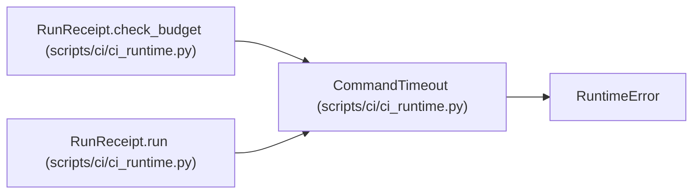

# CommandTimeout

**Location:** `scripts/ci/ci_runtime.py:28`
**Kind:** Class
**Bases:** `RuntimeError`
**Module:** [ci_runtime](../modules/ci_runtime.md)

## Description

An execution deadline was reached. The runner records timed_out before cleaning up its owned process group.

## Attributes

*No annotated attributes found.*

## Methods

*No public methods. Inherits from base classes.*

## Relationships

<!-- Auto-generated relationship summary. Do not edit by hand. -->

### Summary

| Module | Methods | Attributes |
|---|---:|---|
| [ci_runtime](../modules/ci_runtime.md) | 0 | — |

### Structure

| Kind | Entity | Module |
|---|---|---|
| Base | `RuntimeError` | — |

### References

| Reference | Kind | Source | Call sites |
|---|---|---|---:|
| `RunReceipt.check_budget` | call | [ci_runtime](../modules/ci_runtime.md) | 1 |
| `RunReceipt.run` | call | [ci_runtime](../modules/ci_runtime.md) | 1 |
