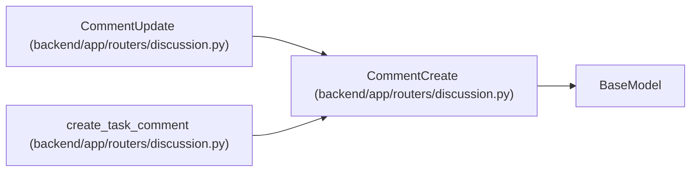

# CommentCreate

**Location:** `backend/app/routers/discussion.py:17`
**Kind:** Pydantic model
**Bases:** `BaseModel`
**Module:** [routers_discussion](../modules/routers_discussion.md)

## Description

_Auto-generated from `CommentCreate` in `backend/app/routers/discussion.py`._

## Attributes

| Name | Type | Wire name | Required | Nullable | Default | Constraints | Examples | Description |
|------|------|-----------|----------|----------|---------|-------------|-------------|----------|
| `body` | `str` | `body` | Yes | No | — | max_length=12000; min_length=1 | — | — |
| `mentions` | `list[PositiveInt]` | `mentions` | No | No | factory: `list` | max_length=25 | — | — |

## Methods

*No public methods. Inherits from base classes.*

## Relationships

<!-- Auto-generated relationship summary. Do not edit by hand. -->

### Summary

| Module | Methods | Attributes |
|---|---:|---|
| [routers_discussion](../modules/routers_discussion.md) | 0 | `body`, `mentions` |

### Structure

| Kind | Entity | Module |
|---|---|---|
| Base | `BaseModel` | — |
| Subclass | `CommentUpdate` | [routers_discussion](../modules/routers_discussion.md) |

### References

| Reference | Kind | Source | Call sites |
|---|---|---|---:|
| `create_task_comment` | type_reference | [routers_discussion](../modules/routers_discussion.md) | — |
