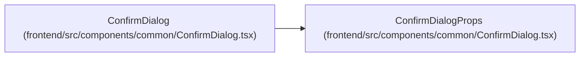

# ConfirmDialogProps

**Location:** `frontend/src/components/common/ConfirmDialog.tsx:10`
**Kind:** Class
**Bases:** —
**Module:** [ConfirmDialog](../modules/ConfirmDialog.md)

## Description

_Auto-generated from `ConfirmDialogProps` in `frontend/src/components/common/ConfirmDialog.tsx`._

## Attributes

| Name | Type | Required | Default | Description |
|------|------|----------|---------|-------------|
| `open` | `boolean` | Yes | — | — |
| `title` | `ReactNode` | Yes | — | — |
| `description` | `ReactNode` | Yes | — | — |
| `confirmLabel` | `string` | Yes | — | — |
| `cancelLabel` | `string` | Yes | — | — |
| `closeLabel` | `string` | Yes | — | — |
| `onConfirm` | `() => void` | Yes | — | — |
| `onCancel` | `() => void` | Yes | — | — |
| `tone` | `ConfirmDialogTone` | No | — | — |
| `pending` | `boolean` | No | — | — |

## Methods

*No public methods. Inherits from base classes.*

## Relationships

<!-- Auto-generated relationship summary. Do not edit by hand. -->

### Summary

| Module | Methods | Attributes |
|---|---:|---|
| [ConfirmDialog](../modules/ConfirmDialog.md) | 0 | `cancelLabel`, `closeLabel`, `confirmLabel`, `description`, `onCancel`, `onConfirm`, `open`, `pending`, `title`, `tone` |

### References

| Reference | Kind | Source | Call sites |
|---|---|---|---:|
| `ConfirmDialog` | type_reference | [ConfirmDialog](../modules/ConfirmDialog.md) | — |
