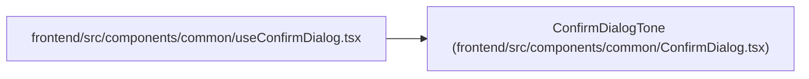

# ConfirmDialogTone

**Location:** `frontend/src/components/common/ConfirmDialog.tsx:8`
**Kind:** Type alias
**Bases:** —
**Module:** [ConfirmDialog](../modules/ConfirmDialog.md)

## Description

_Auto-generated from `ConfirmDialogTone` in `frontend/src/components/common/ConfirmDialog.tsx`._

## Attributes

*No annotated attributes found.*

## Methods

*No public methods. Inherits from base classes.*

## Relationships

<!-- Auto-generated relationship summary. Do not edit by hand. -->

### Summary

| Module | Methods | Attributes |
|---|---:|---|
| [ConfirmDialog](../modules/ConfirmDialog.md) | 0 | — |

### References

| Reference | Kind | Source | Call sites |
|---|---|---|---:|
| `useConfirmDialog` | import | [useConfirmDialog](../modules/useConfirmDialog.md) | — |
