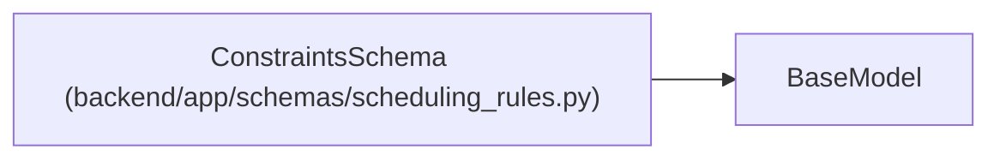

# ConstraintsSchema

**Location:** `backend/app/schemas/scheduling_rules.py:43`
**Kind:** Pydantic model
**Bases:** `BaseModel`
**Module:** [schemas_scheduling_rules](../modules/schemas_scheduling_rules.md)

## Description

Scheduling constraints configuration.

## Attributes

| Name | Type | Wire name | Required | Nullable | Default | Constraints | Examples | Description |
|------|------|-----------|----------|----------|---------|-------------|-------------|----------|
| `sequential_per_assignee` | `bool` | `sequential_per_assignee` | No | No | `True` | — | — | Tasks of same assignee don't overlap |
| `respect_dependencies` | `bool` | `respect_dependencies` | No | No | `True` | — | — | Honor task dependencies |
| `min_start_date` | `bool` | `min_start_date` | No | No | `True` | — | — | Respect task.min_start_date if set |
| `max_finish_date` | `bool` | `max_finish_date` | No | No | `True` | — | — | Respect task deadlines |
| `prefer_uninterrupted` | `bool` | `prefer_uninterrupted` | No | No | `True` | — | — | Prefer slots without vacation interruption |
| `balance_workload` | `Optional[BalanceWorkloadSchema]` | `balance_workload` | No | Yes | `None` | — | — | Workload balancing settings |

## Methods

*No public methods. Inherits from base classes.*

## Relationships

<!-- Auto-generated relationship summary. Do not edit by hand. -->

### Summary

| Module | Methods | Attributes |
|---|---:|---|
| [schemas_scheduling_rules](../modules/schemas_scheduling_rules.md) | 0 | `balance_workload`, `max_finish_date`, `min_start_date`, `prefer_uninterrupted`, `respect_dependencies`, `sequential_per_assignee` |

### Structure

| Kind | Entity | Module |
|---|---|---|
| Base | `BaseModel` | — |
