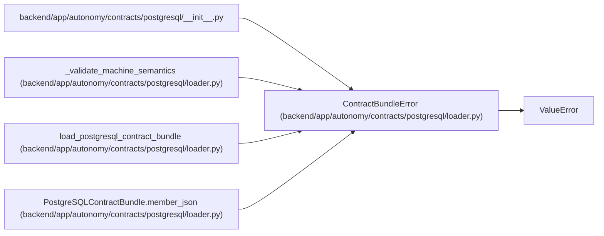

# ContractBundleError

**Location:** `backend/app/autonomy/contracts/postgresql/loader.py:148`
**Kind:** Class
**Bases:** `ValueError`
**Module:** [loader](../modules/loader.md)

## Description

_Auto-generated from `ContractBundleError` in `backend/app/autonomy/contracts/postgresql/loader.py`._

## Attributes

*No annotated attributes found.*

## Methods

*No public methods. Inherits from base classes.*

## Relationships

<!-- Auto-generated relationship summary. Do not edit by hand. -->

### Summary

| Module | Methods | Attributes |
|---|---:|---|
| [loader](../modules/loader.md) | 0 | — |

### Structure

| Kind | Entity | Module |
|---|---|---|
| Base | `ValueError` | — |

### References

| Reference | Kind | Source | Call sites |
|---|---|---|---:|
| `__init__` | import | [postgresql___init__](../modules/postgresql___init__.md) | — |
| `_validate_machine_semantics` | call | [loader](../modules/loader.md) | 14 |
| `load_postgresql_contract_bundle` | call | [loader](../modules/loader.md) | 9 |
| `PostgreSQLContractBundle.member_json` | call | [loader](../modules/loader.md) | 2 |
