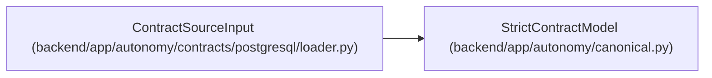

# ContractSourceInput

**Location:** `backend/app/autonomy/contracts/postgresql/loader.py:62`
**Kind:** Pydantic model
**Bases:** `StrictContractModel`
**Module:** [loader](../modules/loader.md)

## Description

_Auto-generated from `ContractSourceInput` in `backend/app/autonomy/contracts/postgresql/loader.py`._

## Attributes

| Name | Type | Wire name | Required | Nullable | Default | Constraints | Examples | Description |
|------|------|-----------|----------|----------|---------|-------------|-------------|----------|
| `logical_key` | `str` | `logical_key` | Yes | No | — | min_length=1; max_length=255 | — | — |
| `sha256` | `str` | `sha256` | Yes | No | — | pattern=unknown (SHA256_PATTERN) | — | — |
| `byte_length` | `int` | `byte_length` | Yes | No | — | ge=1; le=100000000 | — | — |
| `media_type` | `str` | `media_type` | Yes | No | — | min_length=1; max_length=255 | — | — |
| `schema_version` | `str` | `schema_version` | Yes | No | — | min_length=1; max_length=255 | — | — |
| `archive_requirement` | `Literal['charter-pinned-worm-object']` | `archive_requirement` | Yes | No | — | — | — | — |
| `packaged_member` | `str \| None` | `packaged_member` | No | Yes | `None` | pattern=unknown (SAFE_MEMBER_PATTERN) | — | — |

## Methods

*No public methods. Inherits from base classes.*

## Relationships

<!-- Auto-generated relationship summary. Do not edit by hand. -->

### Summary

| Module | Methods | Attributes |
|---|---:|---|
| [loader](../modules/loader.md) | 0 | `archive_requirement`, `byte_length`, `logical_key`, `media_type`, `packaged_member`, `schema_version`, `sha256` |

### Structure

| Kind | Entity | Module |
|---|---|---|
| Base | `StrictContractModel` | [autonomy_canonical](../modules/autonomy_canonical.md) |
