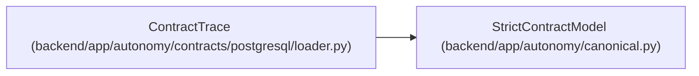

# ContractTrace

**Location:** `backend/app/autonomy/contracts/postgresql/loader.py:78`
**Kind:** Pydantic model
**Bases:** `StrictContractModel`
**Module:** [loader](../modules/loader.md)

## Description

_Auto-generated from `ContractTrace` in `backend/app/autonomy/contracts/postgresql/loader.py`._

## Attributes

| Name | Type | Wire name | Required | Nullable | Default | Constraints | Examples | Description |
|------|------|-----------|----------|----------|---------|-------------|-------------|----------|
| `aut_tasks` | `tuple[str, ...]` | `aut_tasks` | Yes | No | — | — | — | — |
| `dbc_tasks` | `tuple[str, ...]` | `dbc_tasks` | Yes | No | — | — | — | — |
| `dbm_tasks` | `tuple[str, ...]` | `dbm_tasks` | Yes | No | — | — | — | — |
| `gates` | `tuple[str, ...]` | `gates` | Yes | No | — | — | — | — |
| `manual_external` | `tuple[Literal['DBM-DOC-002', 'G15'], ...]` | `manual_external` | Yes | No | — | — | — | — |
| `external_post_publication` | `tuple[Literal['DBM-CLOSE-001'], ...]` | `external_post_publication` | Yes | No | — | — | — | — |

## Methods

*No public methods. Inherits from base classes.*

## Relationships

<!-- Auto-generated relationship summary. Do not edit by hand. -->

### Summary

| Module | Methods | Attributes |
|---|---:|---|
| [loader](../modules/loader.md) | 0 | `aut_tasks`, `dbc_tasks`, `dbm_tasks`, `external_post_publication`, `gates`, `manual_external` |

### Structure

| Kind | Entity | Module |
|---|---|---|
| Base | `StrictContractModel` | [autonomy_canonical](../modules/autonomy_canonical.md) |
