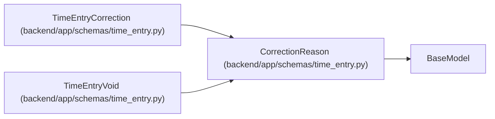

# CorrectionReason

**Location:** `backend/app/schemas/time_entry.py:44`
**Kind:** Pydantic model
**Bases:** `BaseModel`
**Module:** [schemas_time_entry](../modules/schemas_time_entry.md)

## Description

_Auto-generated from `CorrectionReason` in `backend/app/schemas/time_entry.py`._

## Model Configuration

| Setting | Value | Source |
|---------|-------|--------|
| `extra` | `'forbid'` | model_config |

## Validators

| Method | Scope | Fields | Mode | Options |
|--------|-------|--------|------|---------|
| `nonempty_reason` | field | reason | after | — |

## Attributes

| Name | Type | Wire name | Required | Nullable | Default | Constraints | Examples | Description |
|------|------|-----------|----------|----------|---------|-------------|-------------|----------|
| `reason` | `str` | `reason` | Yes | No | — | min_length=1; max_length=1000 | — | — |

## Methods

| Method | Signature | Decorators | Description |
|--------|-----------|------------|-------------|
| `nonempty_reason` | `(value)` | `@field_validator('reason')`, `@classmethod` | — |

## Relationships

<!-- Auto-generated relationship summary. Do not edit by hand. -->

### Summary

| Module | Methods | Attributes |
|---|---:|---|
| [schemas_time_entry](../modules/schemas_time_entry.md) | 1 | `reason` |

### Structure

| Kind | Entity | Module |
|---|---|---|
| Base | `BaseModel` | — |
| Subclass | `TimeEntryCorrection` | [schemas_time_entry](../modules/schemas_time_entry.md) |
| Subclass | `TimeEntryVoid` | [schemas_time_entry](../modules/schemas_time_entry.md) |
