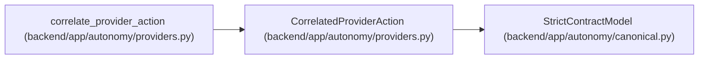

# CorrelatedProviderAction

**Location:** `backend/app/autonomy/providers.py:123`
**Kind:** Pydantic model
**Bases:** `StrictContractModel`
**Module:** [providers](../modules/providers.md)

## Description

_Auto-generated from `CorrelatedProviderAction` in `backend/app/autonomy/providers.py`._

## Attributes

| Name | Type | Wire name | Required | Nullable | Default | Constraints | Examples | Description |
|------|------|-----------|----------|----------|---------|-------------|-------------|----------|
| `schema_version` | `Literal['workchord-correlated-provider-action-v1']` | `schema_version` | No | No | `'workchord-correlated-provider-action-v1'` | — | — | — |
| `lease_digest` | `str` | `lease_digest` | Yes | No | — | pattern=unknown (SHA256_PATTERN) | — | — |
| `operation` | `str` | `operation` | Yes | No | — | min_length=1; max_length=255 | — | — |
| `resource_ref` | `str` | `resource_ref` | Yes | No | — | max_length=2048; pattern=unknown (OPAQUE_REF_PATTERN) | — | — |
| `resource_generation_before` | `str` | `resource_generation_before` | Yes | No | — | min_length=1; max_length=255 | — | — |
| `resource_generation_after` | `str` | `resource_generation_after` | Yes | No | — | min_length=1; max_length=255 | — | — |
| `provider_request_id` | `str` | `provider_request_id` | Yes | No | — | min_length=1; max_length=512 | — | — |
| `provider_event_id` | `str` | `provider_event_id` | Yes | No | — | min_length=1; max_length=512 | — | — |
| `mutation_receipt_digest` | `str` | `mutation_receipt_digest` | Yes | No | — | pattern=unknown (SHA256_PATTERN) | — | — |
| `audit_observation_digest` | `str` | `audit_observation_digest` | Yes | No | — | pattern=unknown (SHA256_PATTERN) | — | — |

## Methods

*No public methods. Inherits from base classes.*

## Relationships

<!-- Auto-generated relationship summary. Do not edit by hand. -->

### Summary

| Module | Methods | Attributes |
|---|---:|---|
| [providers](../modules/providers.md) | 0 | `audit_observation_digest`, `lease_digest`, `mutation_receipt_digest`, `operation`, `provider_event_id`, `provider_request_id`, `resource_generation_after`, `resource_generation_before`, `resource_ref`, `schema_version` |

### Structure

| Kind | Entity | Module |
|---|---|---|
| Base | `StrictContractModel` | [autonomy_canonical](../modules/autonomy_canonical.md) |

### References

| Reference | Kind | Source | Call sites |
|---|---|---|---:|
| `correlate_provider_action` | call | [providers](../modules/providers.md) | 1 |
| `correlate_provider_action` | type_reference | [providers](../modules/providers.md) | — |
