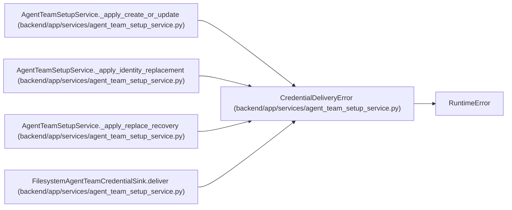

# CredentialDeliveryError

**Location:** `backend/app/services/agent_team_setup_service.py:113`
**Kind:** Class
**Bases:** `RuntimeError`
**Module:** [agent_team_setup_service](../modules/agent_team_setup_service.md)

## Description

Raised when a one-time actor key did not reach the approved sink.

## Attributes

*No annotated attributes found.*

## Methods

*No public methods. Inherits from base classes.*

## Relationships

<!-- Auto-generated relationship summary. Do not edit by hand. -->

### Summary

| Module | Methods | Attributes |
|---|---:|---|
| [agent_team_setup_service](../modules/agent_team_setup_service.md) | 0 | — |

### Structure

| Kind | Entity | Module |
|---|---|---|
| Base | `RuntimeError` | — |

### References

| Reference | Kind | Source | Call sites |
|---|---|---|---:|
| `AgentTeamSetupService._apply_create_or_update` | call | [agent_team_setup_service](../modules/agent_team_setup_service.md) | 1 |
| `AgentTeamSetupService._apply_identity_replacement` | call | [agent_team_setup_service](../modules/agent_team_setup_service.md) | 1 |
| `AgentTeamSetupService._apply_replace_recovery` | call | [agent_team_setup_service](../modules/agent_team_setup_service.md) | 2 |
| `FilesystemAgentTeamCredentialSink.deliver` | call | [agent_team_setup_service](../modules/agent_team_setup_service.md) | 5 |
