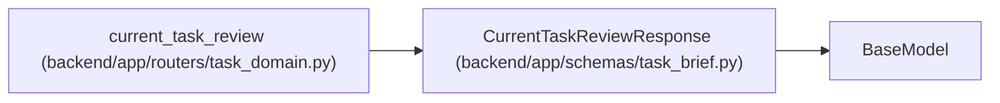

# CurrentTaskReviewResponse

**Location:** `backend/app/schemas/task_brief.py:103`
**Kind:** Pydantic model
**Bases:** `BaseModel`
**Module:** [schemas_task_brief](../modules/schemas_task_brief.md)

## Description

Carries the current task version and a matching independent verdict or an explicit null. It separates current-review lookup from bounded history pages, so older records cannot hide the current result.

## Attributes

| Name | Type | Wire name | Required | Nullable | Default | Constraints | Examples | Description |
|------|------|-----------|----------|----------|---------|-------------|-------------|----------|
| `task_version` | `int` | `task_version` | Yes | No | — | — | — | — |
| `review` | `TaskReviewResponse \| None` | `review` | Yes | Yes | — | — | — | — |

## Methods

*No public methods. Inherits from base classes.*

## Relationships

<!-- Auto-generated relationship summary. Do not edit by hand. -->

### Summary

| Module | Methods | Attributes |
|---|---:|---|
| [schemas_task_brief](../modules/schemas_task_brief.md) | 0 | `review`, `task_version` |

### Structure

| Kind | Entity | Module |
|---|---|---|
| Base | `BaseModel` | — |

### References

| Reference | Kind | Source | Call sites |
|---|---|---|---:|
| `current_task_review` | type_reference | [routers_task_domain](../modules/routers_task_domain.md) | — |
