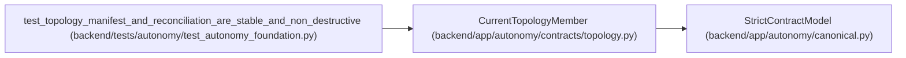

# CurrentTopologyMember

**Location:** `backend/app/autonomy/contracts/topology.py:240`
**Kind:** Pydantic model
**Bases:** `StrictContractModel`
**Module:** [topology](../modules/topology.md)

## Description

_Auto-generated from `CurrentTopologyMember` in `backend/app/autonomy/contracts/topology.py`._

## Attributes

| Name | Type | Wire name | Required | Nullable | Default | Constraints | Examples | Description |
|------|------|-----------|----------|----------|---------|-------------|-------------|----------|
| `logical_key` | `str` | `logical_key` | Yes | No | — | pattern=unknown (LOGICAL_KEY_PATTERN) | — | — |
| `actor_name` | `str` | `actor_name` | Yes | No | — | pattern=unknown (LOGICAL_KEY_PATTERN) | — | — |
| `topology_key` | `str \| None` | `topology_key` | No | Yes | `None` | pattern=unknown (LOGICAL_KEY_PATTERN) | — | — |
| `object_revision` | `int` | `object_revision` | Yes | No | — | ge=1 | — | — |
| `lifecycle_state` | `TopologyLifecycleState` | `lifecycle_state` | Yes | No | — | — | — | — |
| `desired_contract` | `TopologyMemberContract` | `desired_contract` | Yes | No | — | — | — | — |

## Methods

*No public methods. Inherits from base classes.*

## Relationships

<!-- Auto-generated relationship summary. Do not edit by hand. -->

### Summary

| Module | Methods | Attributes |
|---|---:|---|
| [topology](../modules/topology.md) | 0 | `actor_name`, `desired_contract`, `lifecycle_state`, `logical_key`, `object_revision`, `topology_key` |

### Structure

| Kind | Entity | Module |
|---|---|---|
| Base | `StrictContractModel` | [autonomy_canonical](../modules/autonomy_canonical.md) |

### References

| Reference | Kind | Source | Call sites |
|---|---|---|---:|
| `test_topology_manifest_and_reconciliation_are_stable_and_non_destructive` | call | [test_autonomy_foundation](../modules/test_autonomy_foundation.md) | 2 |
