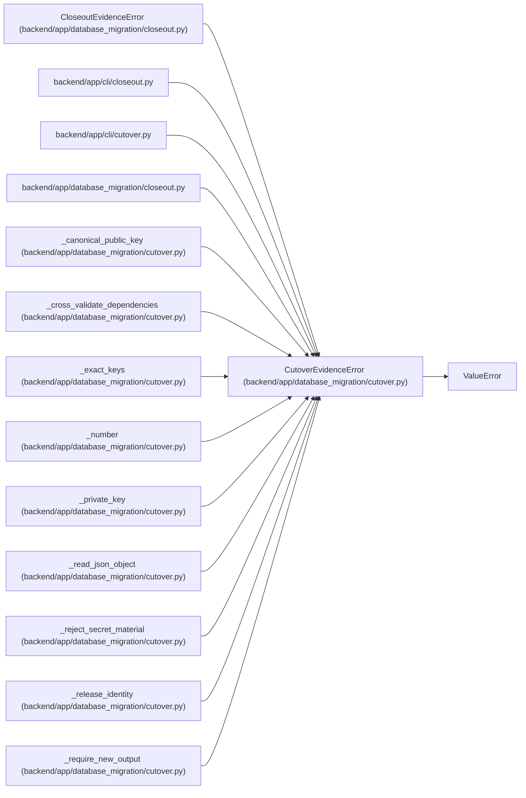

# CutoverEvidenceError

**Location:** `backend/app/database_migration/cutover.py:142`
**Kind:** Class
**Bases:** `ValueError`
**Module:** [database_migration_cutover](../modules/database_migration_cutover.md)

## Description

A cutover input is unsafe, stale, incomplete, or internally inconsistent.

## Attributes

*No annotated attributes found.*

## Methods

*No public methods. Inherits from base classes.*

## Relationships

<!-- Auto-generated relationship summary. Do not edit by hand. -->

### Summary

| Module | Methods | Attributes |
|---|---:|---|
| [database_migration_cutover](../modules/database_migration_cutover.md) | 0 | — |

### Structure

| Kind | Entity | Module |
|---|---|---|
| Base | `ValueError` | — |
| Subclass | `CloseoutEvidenceError` | [database_migration_closeout](../modules/database_migration_closeout.md) |

### References

| Reference | Kind | Source | Call sites |
|---|---|---|---:|
| `closeout` | import | [cli_closeout](../modules/cli_closeout.md) | — |
| `cutover` | import | [cli_cutover](../modules/cli_cutover.md) | — |
| `closeout` | import | [database_migration_closeout](../modules/database_migration_closeout.md) | — |
| `_canonical_public_key` | call | [database_migration_cutover](../modules/database_migration_cutover.md) | 1 |
| `_cross_validate_dependencies` | call | [database_migration_cutover](../modules/database_migration_cutover.md) | 2 |
| `_exact_keys` | call | [database_migration_cutover](../modules/database_migration_cutover.md) | 1 |
| `_number` | call | [database_migration_cutover](../modules/database_migration_cutover.md) | 2 |
| `_private_key` | call | [database_migration_cutover](../modules/database_migration_cutover.md) | 3 |
| `_read_json_object` | call | [database_migration_cutover](../modules/database_migration_cutover.md) | 2 |
| `_reject_secret_material` | call | [database_migration_cutover](../modules/database_migration_cutover.md) | 3 |
| `_release_identity` | call | [database_migration_cutover](../modules/database_migration_cutover.md) | 4 |
| `_require_new_output` | call | [database_migration_cutover](../modules/database_migration_cutover.md) | 1 |

> References: showing 12 of 36 logical references; 24 omitted by the 12-row generated summary limit.
