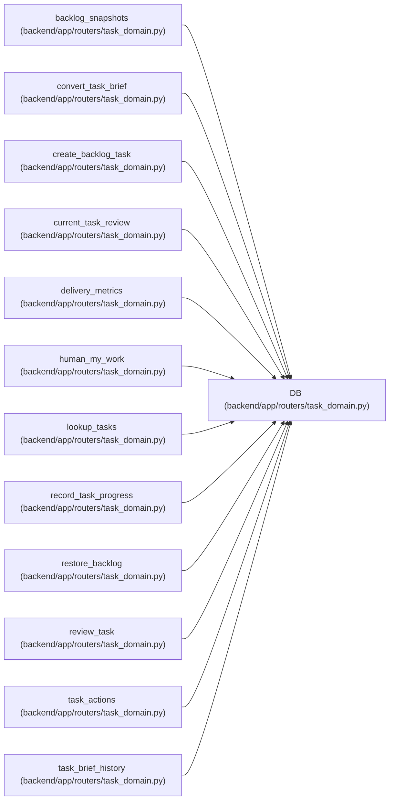

# DB

**Location:** `backend/app/routers/task_domain.py:22`
**Kind:** Type alias
**Bases:** —
**Module:** [routers_task_domain](../modules/routers_task_domain.md)
**Target:** `Annotated[AsyncSession, Depends(get_db, scope='function')]`

## Description

_Auto-generated from `DB` in `backend/app/routers/task_domain.py`._

## Attributes

*No annotated attributes found.*

## Methods

*No public methods. Inherits from base classes.*

## Relationships

<!-- Auto-generated relationship summary. Do not edit by hand. -->

### Summary

| Module | Methods | Attributes |
|---|---:|---|
| [routers_task_domain](../modules/routers_task_domain.md) | 0 | — |

### References

| Reference | Kind | Source | Call sites |
|---|---|---|---:|
| `backlog_snapshots` | type_reference | [routers_task_domain](../modules/routers_task_domain.md) | — |
| `convert_task_brief` | type_reference | [routers_task_domain](../modules/routers_task_domain.md) | — |
| `create_backlog_task` | type_reference | [routers_task_domain](../modules/routers_task_domain.md) | — |
| `current_task_review` | type_reference | [routers_task_domain](../modules/routers_task_domain.md) | — |
| `delivery_metrics` | type_reference | [routers_task_domain](../modules/routers_task_domain.md) | — |
| `human_my_work` | type_reference | [routers_task_domain](../modules/routers_task_domain.md) | — |
| `lookup_tasks` | type_reference | [routers_task_domain](../modules/routers_task_domain.md) | — |
| `record_task_progress` | type_reference | [routers_task_domain](../modules/routers_task_domain.md) | — |
| `restore_backlog` | type_reference | [routers_task_domain](../modules/routers_task_domain.md) | — |
| `review_task` | type_reference | [routers_task_domain](../modules/routers_task_domain.md) | — |
| `task_actions` | type_reference | [routers_task_domain](../modules/routers_task_domain.md) | — |
| `task_brief_history` | type_reference | [routers_task_domain](../modules/routers_task_domain.md) | — |

> References: showing 12 of 21 logical references; 9 omitted by the 12-row generated summary limit.
