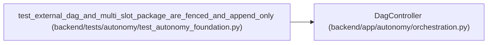

# DagController

**Location:** `backend/app/autonomy/orchestration.py:211`
**Kind:** Class
**Bases:** —
**Module:** [orchestration](../modules/orchestration.md)

## Description

Commit authoritative state externally before any WorkChord projection.

## Attributes

*No annotated attributes found.*

## Methods

| Method | Signature | Decorators | Description |
|--------|-----------|------------|-------------|
| `__init__` | `(*, contract: AutonomousDagContract, journal: ExternalDagJournal, controller_subject: str, clock: Callable[[], datetime] = lambda: datetime.now(UTC), maximum_cas_attempts: int = 8) -> None` | — | — |
| `initialize` | `() -> None` | — | Append one planned genesis per node in canonical topological order. |
| `current_states` | `() -> dict[str, DagNodeState]` | — | — |
| `transition` | `(*, node_id: str, to_state: DagNodeState, transition: str, lease_digest: str \| None = None, attempt_start_digest: str \| None = None, evidence_digest: str \| None = None, checkpoint_digest: str \| None = None, reason_code: str \| None = None) -> DagJournalEntry` | — | — |
| `reset_dependents` | `(*, failed_node_id: str, reason_code: str) -> tuple[DagJournalEntry, ...]` | — | Append resets in stable dependency order without rewriting history. |
| `_validated_snapshot` | `() -> DagJournalSnapshot` | — | — |
| `_topological_order` | `() -> tuple[str, ...]` | — | — |

## Relationships

<!-- Auto-generated relationship summary. Do not edit by hand. -->

### Summary

| Module | Methods | Attributes |
|---|---:|---|
| [orchestration](../modules/orchestration.md) | 7 | — |

### References

| Reference | Kind | Source | Call sites |
|---|---|---|---:|
| `test_external_dag_and_multi_slot_package_are_fenced_and_append_only` | call | [test_autonomy_foundation](../modules/test_autonomy_foundation.md) | 1 |
