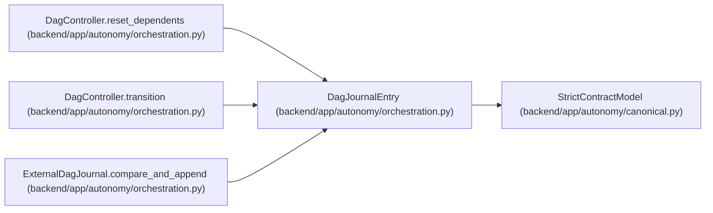

# DagJournalEntry

**Location:** `backend/app/autonomy/orchestration.py:108`
**Kind:** Pydantic model
**Bases:** `StrictContractModel`
**Module:** [orchestration](../modules/orchestration.md)

## Description

_Auto-generated from `DagJournalEntry` in `backend/app/autonomy/orchestration.py`._

## Validators

| Method | Scope | Fields | Mode | Options |
|--------|-------|--------|------|---------|
| `aware_time` | field | recorded_at | after | — |

## Attributes

| Name | Type | Wire name | Required | Nullable | Default | Constraints | Examples | Description |
|------|------|-----------|----------|----------|---------|-------------|-------------|----------|
| `schema_version` | `Literal['workchord-dag-journal-entry-v1']` | `schema_version` | No | No | `'workchord-dag-journal-entry-v1'` | — | — | — |
| `sequence` | `int` | `sequence` | Yes | No | — | ge=1 | — | — |
| `run_id` | `str` | `run_id` | Yes | No | — | pattern=unknown (IDENTIFIER_PATTERN) | — | — |
| `dag_digest` | `str` | `dag_digest` | Yes | No | — | pattern=unknown (SHA256_PATTERN) | — | — |
| `node_id` | `str` | `node_id` | Yes | No | — | pattern=unknown (IDENTIFIER_PATTERN) | — | — |
| `node_version` | `int` | `node_version` | Yes | No | — | ge=1 | — | — |
| `from_state` | `DagNodeState \| None` | `from_state` | Yes | Yes | — | — | — | — |
| `to_state` | `DagNodeState` | `to_state` | Yes | No | — | — | — | — |
| `transition` | `str` | `transition` | Yes | No | — | pattern=unknown (IDENTIFIER_PATTERN) | — | — |
| `controller_subject` | `str` | `controller_subject` | Yes | No | — | max_length=512; min_length=1 | — | — |
| `cas_revision` | `int` | `cas_revision` | Yes | No | — | ge=1 | — | — |
| `lease_digest` | `str \| None` | `lease_digest` | No | Yes | `None` | pattern=unknown (SHA256_PATTERN) | — | — |
| `attempt_start_digest` | `str \| None` | `attempt_start_digest` | No | Yes | `None` | pattern=unknown (SHA256_PATTERN) | — | — |
| `evidence_digest` | `str \| None` | `evidence_digest` | No | Yes | `None` | pattern=unknown (SHA256_PATTERN) | — | — |
| `checkpoint_digest` | `str \| None` | `checkpoint_digest` | No | Yes | `None` | pattern=unknown (SHA256_PATTERN) | — | — |
| `reason_code` | `str \| None` | `reason_code` | No | Yes | `None` | pattern=unknown (IDENTIFIER_PATTERN) | — | — |
| `recorded_at` | `datetime` | `recorded_at` | Yes | No | — | — | — | — |
| `previous_hash` | `str` | `previous_hash` | Yes | No | — | pattern=unknown (SHA256_PATTERN) | — | — |

## Methods

| Method | Signature | Decorators | Description |
|--------|-----------|------------|-------------|
| `aware_time` | `(value: datetime) -> datetime` | `@field_validator('recorded_at')`, `@classmethod` | — |
| `digest` | `() -> str` | — | — |

## Relationships

<!-- Auto-generated relationship summary. Do not edit by hand. -->

### Summary

| Module | Methods | Attributes |
|---|---:|---|
| [orchestration](../modules/orchestration.md) | 2 | `attempt_start_digest`, `cas_revision`, `checkpoint_digest`, `controller_subject`, `dag_digest`, `evidence_digest`, `from_state`, `lease_digest`, `node_id`, `node_version`, `previous_hash`, `reason_code` |

### Structure

| Kind | Entity | Module |
|---|---|---|
| Base | `StrictContractModel` | [autonomy_canonical](../modules/autonomy_canonical.md) |

### References

| Reference | Kind | Source | Call sites |
|---|---|---|---:|
| `DagController.reset_dependents` | type_reference | [orchestration](../modules/orchestration.md) | — |
| `DagController.transition` | call | [orchestration](../modules/orchestration.md) | 1 |
| `DagController.transition` | type_reference | [orchestration](../modules/orchestration.md) | — |
| `ExternalDagJournal.compare_and_append` | type_reference | [orchestration](../modules/orchestration.md) | — |
