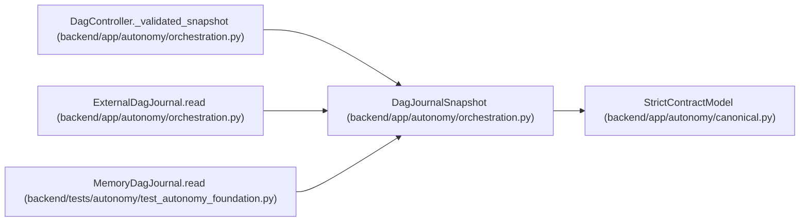

# DagJournalSnapshot

**Location:** `backend/app/autonomy/orchestration.py:141`
**Kind:** Pydantic model
**Bases:** `StrictContractModel`
**Module:** [orchestration](../modules/orchestration.md)

## Description

_Auto-generated from `DagJournalSnapshot` in `backend/app/autonomy/orchestration.py`._

## Attributes

| Name | Type | Wire name | Required | Nullable | Default | Constraints | Examples | Description |
|------|------|-----------|----------|----------|---------|-------------|-------------|----------|
| `revision` | `int` | `revision` | Yes | No | — | ge=0 | — | — |
| `head_digest` | `str` | `head_digest` | Yes | No | — | pattern=unknown (SHA256_PATTERN) | — | — |
| `entries` | `tuple[DagJournalEntry, ...]` | `entries` | No | No | `()` | max_length=2000000 | — | — |

## Methods

*No public methods. Inherits from base classes.*

## Relationships

<!-- Auto-generated relationship summary. Do not edit by hand. -->

### Summary

| Module | Methods | Attributes |
|---|---:|---|
| [orchestration](../modules/orchestration.md) | 0 | `entries`, `head_digest`, `revision` |

### Structure

| Kind | Entity | Module |
|---|---|---|
| Base | `StrictContractModel` | [autonomy_canonical](../modules/autonomy_canonical.md) |

### References

| Reference | Kind | Source | Call sites |
|---|---|---|---:|
| `DagController._validated_snapshot` | type_reference | [orchestration](../modules/orchestration.md) | — |
| `ExternalDagJournal.read` | type_reference | [orchestration](../modules/orchestration.md) | — |
| `MemoryDagJournal.read` | call | [test_autonomy_foundation](../modules/test_autonomy_foundation.md) | 1 |
| `MemoryDagJournal.read` | type_reference | [test_autonomy_foundation](../modules/test_autonomy_foundation.md) | — |
