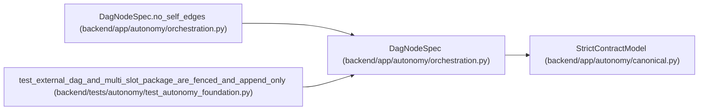

# DagNodeSpec

**Location:** `backend/app/autonomy/orchestration.py:41`
**Kind:** Pydantic model
**Bases:** `StrictContractModel`
**Module:** [orchestration](../modules/orchestration.md)

## Description

_Auto-generated from `DagNodeSpec` in `backend/app/autonomy/orchestration.py`._

## Validators

| Method | Scope | Fields | Mode | Options |
|--------|-------|--------|------|---------|
| `unique_values` | field | dependencies, reset_targets, retry_classes | after | — |
| `no_self_edges` | model | — | after | — |

## Attributes

| Name | Type | Wire name | Required | Nullable | Default | Constraints | Examples | Description |
|------|------|-----------|----------|----------|---------|-------------|-------------|----------|
| `node_id` | `str` | `node_id` | Yes | No | — | pattern=unknown (IDENTIFIER_PATTERN) | — | — |
| `node_version` | `int` | `node_version` | Yes | No | — | ge=1 | — | — |
| `dependencies` | `tuple[str, ...]` | `dependencies` | No | No | `()` | max_length=256 | — | — |
| `reset_targets` | `tuple[str, ...]` | `reset_targets` | No | No | `()` | max_length=256 | — | — |
| `timeout_seconds` | `int` | `timeout_seconds` | Yes | No | — | ge=1; le=2592000 | — | — |
| `maximum_attempts` | `int` | `maximum_attempts` | Yes | No | — | ge=1; le=100 | — | — |
| `retry_classes` | `tuple[str, ...]` | `retry_classes` | No | No | `()` | max_length=128 | — | — |
| `maximum_cost_minor_units` | `int` | `maximum_cost_minor_units` | Yes | No | — | ge=0 | — | — |
| `evaluator_version` | `str` | `evaluator_version` | Yes | No | — | max_length=255; min_length=1 | — | — |
| `source_contract_digest` | `str` | `source_contract_digest` | Yes | No | — | pattern=unknown (SHA256_PATTERN) | — | — |

## Methods

| Method | Signature | Decorators | Description |
|--------|-----------|------------|-------------|
| `unique_values` | `(value: tuple[str, ...]) -> tuple[str, ...]` | `@field_validator('dependencies', 'reset_targets', 'retry_classes')`, `@classmethod` | — |
| `no_self_edges` | `() -> 'DagNodeSpec'` | `@model_validator(mode='after')` | — |

## Relationships

<!-- Auto-generated relationship summary. Do not edit by hand. -->

### Summary

| Module | Methods | Attributes |
|---|---:|---|
| [orchestration](../modules/orchestration.md) | 2 | `dependencies`, `evaluator_version`, `maximum_attempts`, `maximum_cost_minor_units`, `node_id`, `node_version`, `reset_targets`, `retry_classes`, `source_contract_digest`, `timeout_seconds` |

### Structure

| Kind | Entity | Module |
|---|---|---|
| Base | `StrictContractModel` | [autonomy_canonical](../modules/autonomy_canonical.md) |

### References

| Reference | Kind | Source | Call sites |
|---|---|---|---:|
| `DagNodeSpec.no_self_edges` | type_reference | [orchestration](../modules/orchestration.md) | — |
| `test_external_dag_and_multi_slot_package_are_fenced_and_append_only` | call | [test_autonomy_foundation](../modules/test_autonomy_foundation.md) | 2 |
