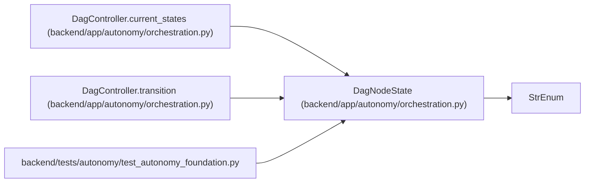

# DagNodeState

**Location:** `backend/app/autonomy/orchestration.py:20`
**Kind:** Enum
**Bases:** `StrEnum`
**Module:** [orchestration](../modules/orchestration.md)

## Description

_Auto-generated from `DagNodeState` in `backend/app/autonomy/orchestration.py`._

## Attributes

| Name | Declared value | Description |
|------|-------|-------------|
| `PLANNED` | `'planned'` | — |
| `READY` | `'ready'` | — |
| `LEASED` | `'leased'` | — |
| `RUNNING` | `'running'` | — |
| `EVIDENCE_PENDING` | `'evidence_pending'` | — |
| `EVALUATING` | `'evaluating'` | — |
| `PASSED` | `'passed'` | — |
| `FAILED` | `'failed'` | — |
| `BLOCKED_EXTERNAL` | `'blocked_external'` | — |
| `RESET_REQUIRED` | `'reset_required'` | — |

## Methods

*No public methods. Inherits from base classes.*

## Relationships

<!-- Auto-generated relationship summary. Do not edit by hand. -->

### Summary

| Module | Methods | Attributes |
|---|---:|---|
| [orchestration](../modules/orchestration.md) | 0 | `BLOCKED_EXTERNAL`, `EVALUATING`, `EVIDENCE_PENDING`, `FAILED`, `LEASED`, `PASSED`, `PLANNED`, `READY`, `RESET_REQUIRED`, `RUNNING` |

### Structure

| Kind | Entity | Module |
|---|---|---|
| Base | `StrEnum` | — |

### References

| Reference | Kind | Source | Call sites |
|---|---|---|---:|
| `DagController.current_states` | type_reference | [orchestration](../modules/orchestration.md) | — |
| `DagController.transition` | type_reference | [orchestration](../modules/orchestration.md) | — |
| `test_autonomy_foundation` | import | [test_autonomy_foundation](../modules/test_autonomy_foundation.md) | — |
