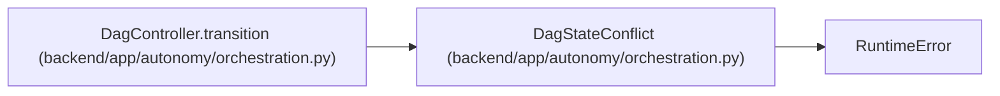

# DagStateConflict

**Location:** `backend/app/autonomy/orchestration.py:163`
**Kind:** Class
**Bases:** `RuntimeError`
**Module:** [orchestration](../modules/orchestration.md)

## Description

_Auto-generated from `DagStateConflict` in `backend/app/autonomy/orchestration.py`._

## Attributes

*No annotated attributes found.*

## Methods

*No public methods. Inherits from base classes.*

## Relationships

<!-- Auto-generated relationship summary. Do not edit by hand. -->

### Summary

| Module | Methods | Attributes |
|---|---:|---|
| [orchestration](../modules/orchestration.md) | 0 | — |

### Structure

| Kind | Entity | Module |
|---|---|---|
| Base | `RuntimeError` | — |

### References

| Reference | Kind | Source | Call sites |
|---|---|---|---:|
| `DagController.transition` | call | [orchestration](../modules/orchestration.md) | 1 |
