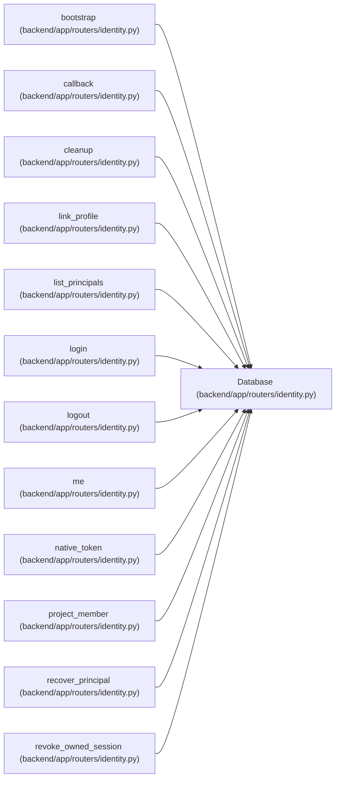

# Database

**Location:** `backend/app/routers/identity.py:25`
**Kind:** Type alias
**Bases:** —
**Module:** [routers_identity](../modules/routers_identity.md)
**Target:** `Annotated[object, Depends(get_db, scope='function')]`

## Description

_Auto-generated from `Database` in `backend/app/routers/identity.py`._

## Attributes

*No annotated attributes found.*

## Methods

*No public methods. Inherits from base classes.*

## Relationships

<!-- Auto-generated relationship summary. Do not edit by hand. -->

### Summary

| Module | Methods | Attributes |
|---|---:|---|
| [routers_identity](../modules/routers_identity.md) | 0 | — |

### References

| Reference | Kind | Source | Call sites |
|---|---|---|---:|
| `bootstrap` | type_reference | [routers_identity](../modules/routers_identity.md) | — |
| `callback` | type_reference | [routers_identity](../modules/routers_identity.md) | — |
| `cleanup` | type_reference | [routers_identity](../modules/routers_identity.md) | — |
| `link_profile` | type_reference | [routers_identity](../modules/routers_identity.md) | — |
| `list_principals` | type_reference | [routers_identity](../modules/routers_identity.md) | — |
| `login` | type_reference | [routers_identity](../modules/routers_identity.md) | — |
| `logout` | type_reference | [routers_identity](../modules/routers_identity.md) | — |
| `me` | type_reference | [routers_identity](../modules/routers_identity.md) | — |
| `native_token` | type_reference | [routers_identity](../modules/routers_identity.md) | — |
| `project_member` | type_reference | [routers_identity](../modules/routers_identity.md) | — |
| `recover_principal` | type_reference | [routers_identity](../modules/routers_identity.md) | — |
| `revoke_owned_session` | type_reference | [routers_identity](../modules/routers_identity.md) | — |

> References: showing 12 of 15 logical references; 3 omitted by the 12-row generated summary limit.
