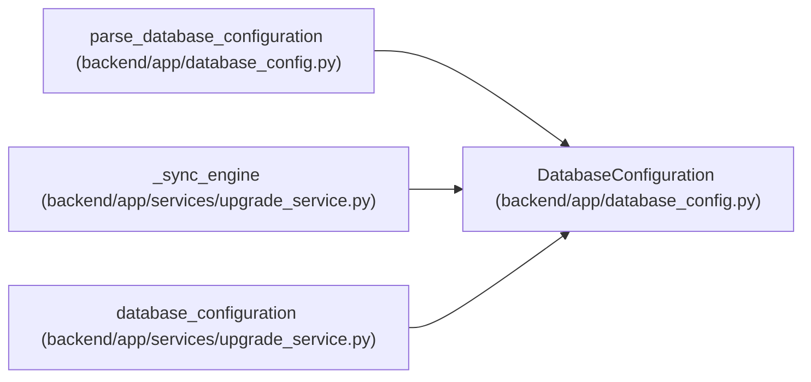

# DatabaseConfiguration

**Location:** `backend/app/database_config.py:44`
**Kind:** Class
**Bases:** —
**Module:** [database_config](../modules/database_config.md)

**Decorators:** `@dataclass(frozen=True)`

## Description

Validated, dialect-specific database configuration.

## Attributes

| Name | Type | Default | Description |
|------|------|---------|-------------|
| `async_url` | `URL` | *required* | — |
| `sync_url` | `URL` | *required* | — |
| `backend` | `str` | *required* | — |
| `redacted_url` | `str` | *required* | — |
| `process_role` | `str` | *required* | — |
| `session_role` | `str` | *required* | — |
| `approved_connection_capacity` | `int` | *required* | — |
| `connect_args` | `Mapping[str, Any]` | *required* | — |
| `pool_size` | `int \| None` | *required* | — |
| `max_overflow` | `int \| None` | *required* | — |
| `pool_timeout_seconds` | `float \| None` | *required* | — |
| `pool_recycle_seconds` | `int` | *required* | — |
| `pool_pre_ping` | `bool` | *required* | — |

## Methods

| Method | Signature | Decorators | Description |
|--------|-----------|------------|-------------|
| `bounded_connection_capacity` | `() -> int \| None` | `@property` | — |
| `async_engine_kwargs` | `(*, echo: bool = False) -> dict[str, Any]` | — | — |
| `summary` | `() -> dict[str, Any]` | — | Return observable connection policy without credentials. |

## Relationships

<!-- Auto-generated relationship summary. Do not edit by hand. -->

### Summary

| Module | Methods | Attributes |
|---|---:|---|
| [database_config](../modules/database_config.md) | 3 | `approved_connection_capacity`, `async_url`, `backend`, `connect_args`, `max_overflow`, `pool_pre_ping`, `pool_recycle_seconds`, `pool_size`, `pool_timeout_seconds`, `process_role`, `redacted_url`, `session_role` |

### References

| Reference | Kind | Source | Call sites |
|---|---|---|---:|
| `parse_database_configuration` | call | [database_config](../modules/database_config.md) | 2 |
| `parse_database_configuration` | type_reference | [database_config](../modules/database_config.md) | — |
| `_sync_engine` | type_reference | [upgrade_service](../modules/upgrade_service.md) | — |
| `database_configuration` | type_reference | [upgrade_service](../modules/upgrade_service.md) | — |
