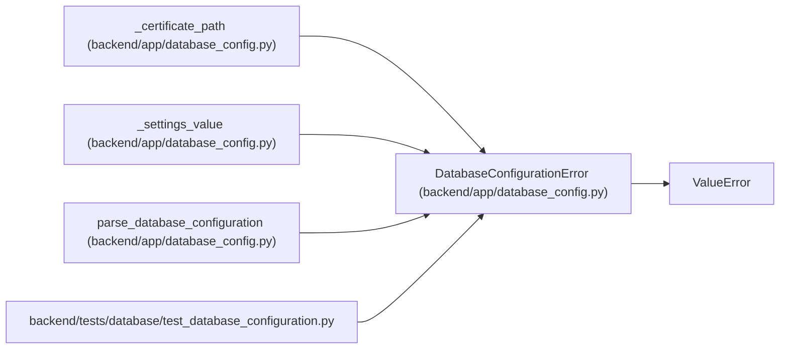

# DatabaseConfigurationError

**Location:** `backend/app/database_config.py:39`
**Kind:** Class
**Bases:** `ValueError`
**Module:** [database_config](../modules/database_config.md)

## Description

Raised when database settings are unsupported or unsafe.

## Attributes

*No annotated attributes found.*

## Methods

*No public methods. Inherits from base classes.*

## Relationships

<!-- Auto-generated relationship summary. Do not edit by hand. -->

### Summary

| Module | Methods | Attributes |
|---|---:|---|
| [database_config](../modules/database_config.md) | 0 | — |

### Structure

| Kind | Entity | Module |
|---|---|---|
| Base | `ValueError` | — |

### References

| Reference | Kind | Source | Call sites |
|---|---|---|---:|
| `_certificate_path` | call | [database_config](../modules/database_config.md) | 2 |
| `_settings_value` | call | [database_config](../modules/database_config.md) | 1 |
| `parse_database_configuration` | call | [database_config](../modules/database_config.md) | 20 |
| `test_database_configuration` | import | [test_database_configuration](../modules/test_database_configuration.md) | — |
