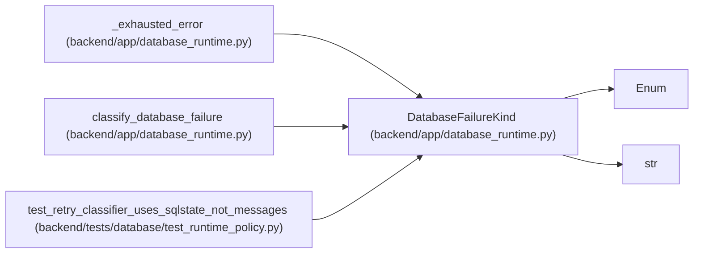

# DatabaseFailureKind

**Location:** `backend/app/database_runtime.py:40`
**Kind:** Enum
**Bases:** `str`, `Enum`
**Module:** [database_runtime](../modules/database_runtime.md)

## Description

_Auto-generated from `DatabaseFailureKind` in `backend/app/database_runtime.py`._

## Attributes

| Name | Declared value | Description |
|------|-------|-------------|
| `SERIALIZATION` | `'serialization'` | — |
| `DEADLOCK` | `'deadlock'` | — |
| `CONNECTION` | `'connection'` | — |

## Methods

*No public methods. Inherits from base classes.*

## Relationships

<!-- Auto-generated relationship summary. Do not edit by hand. -->

### Summary

| Module | Methods | Attributes |
|---|---:|---|
| [database_runtime](../modules/database_runtime.md) | 0 | `CONNECTION`, `DEADLOCK`, `SERIALIZATION` |

### Structure

| Kind | Entity | Module |
|---|---|---|
| Base | `Enum` | — |
| Base | `str` | — |

### References

| Reference | Kind | Source | Call sites |
|---|---|---|---:|
| `_exhausted_error` | type_reference | [database_runtime](../modules/database_runtime.md) | — |
| `classify_database_failure` | type_reference | [database_runtime](../modules/database_runtime.md) | — |
| `test_retry_classifier_uses_sqlstate_not_messages` | type_reference | [test_runtime_policy](../modules/test_runtime_policy.md) | — |
