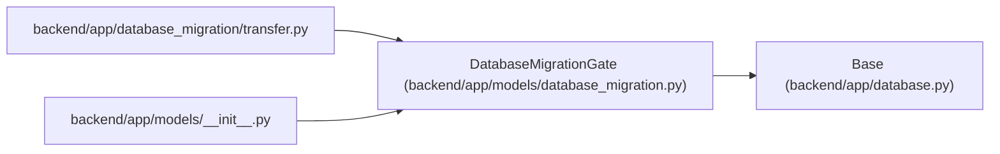

# DatabaseMigrationGate

**Location:** `backend/app/models/database_migration.py:15`
**Kind:** Class
**Bases:** `Base`
**Module:** [models_database_migration](../modules/models_database_migration.md)

## Description

Fail-closed progress for one catalogued database transfer.

Rows in this table are operational target state. They are deliberately not
copied from SQLite. Readiness remains false while any row is not fully
reconciled, so a partially loaded target cannot accidentally serve traffic.

## Attributes

| Name | Type | Default | Description |
|------|------|---------|-------------|
| `run_id` | `Mapped[str]` | `mapped_column(String(64), primary_key=True)` | — |
| `source_manifest_sha256` | `Mapped[str]` | `mapped_column(String(64), nullable=False)` | — |
| `source_snapshot_sha256` | `Mapped[str]` | `mapped_column(String(64), nullable=False)` | — |
| `target_identity_sha256` | `Mapped[str]` | `mapped_column(String(64), nullable=False)` | — |
| `status` | `Mapped[str]` | `mapped_column(String(30), nullable=False)` | — |
| `completed_tables` | `Mapped[list[Any]]` | `mapped_column(JSON, default=list, nullable=False)` | — |
| `failure_code` | `Mapped[Optional[str]]` | `mapped_column(String(120), nullable=True)` | — |
| `raw_report_sha256` | `Mapped[Optional[str]]` | `mapped_column(String(64), nullable=True)` | — |
| `reconciliation_report_sha256` | `Mapped[Optional[str]]` | `mapped_column(String(64), nullable=True)` | — |
| `created_at` | `Mapped[datetime]` | `mapped_column(UTCDateTime(), default=utc_now, nullable=False)` | — |
| `updated_at` | `Mapped[datetime]` | `mapped_column(UTCDateTime(), default=utc_now, onupdate=utc_now, nullable=False)` | — |

## Methods

*No public methods. Inherits from base classes.*

## Relationships

<!-- Auto-generated relationship summary. Do not edit by hand. -->

### Summary

| Module | Methods | Attributes |
|---|---:|---|
| [models_database_migration](../modules/models_database_migration.md) | 0 | `completed_tables`, `created_at`, `failure_code`, `raw_report_sha256`, `reconciliation_report_sha256`, `run_id`, `source_manifest_sha256`, `source_snapshot_sha256`, `status`, `target_identity_sha256`, `updated_at` |

### Structure

| Kind | Entity | Module |
|---|---|---|
| Base | `Base` | [app_database](../modules/app_database.md) |

### References

| Reference | Kind | Source | Call sites |
|---|---|---|---:|
| `transfer` | import | [transfer](../modules/transfer.md) | — |
| `__init__` | import | [models___init__](../modules/models___init__.md) | — |
